##  一、引言
### 简介：
    本文将介绍Dictionary的常见方法，并深入了解内部实现原理，包括哈希表、扩容机制和性能优化等。同时，还将讨论Dictionary在多线程环境下使用时的注意事项和解决方案，并提供一些性能调优的建议。    
### 目的：
    通过本文，读者能够根据实际需求选择合适的数据结构。包括如何优化性能、避免常见错误等。
##  二、Dictionary的基本概念
### 定义：
Dictionary<TKey, TValue>是一个泛型集合，用于存储键值对，其中键是唯一的。
1. 命名空间：**System.Collections.Generic**，在DotNet Framework 2.0中随着泛型集合的引入而出现。
2. 泛型类型：支持为不同的数据类型创建Dictionary实例，无需进行类型转换，装箱/拆箱，代码重用性搞。
```C#
    static void Main()
    {
        // 为不同的数据类型创建Dictionary实例
        Dictionary<string, Person> people = new Dictionary<string, Person>();
        people.Add("Alice", new Person { Name = "Alice", Age = 30 });
    }
```
3. 唯一键：每个键在Dictionary中是唯一的，不允许重复；如果尝试添加一个已经存在的键，则会抛出异常。
```C#
    static void Main()
    {
        Dictionary<string, int> ages = new Dictionary<string, int>();
        ages.Add("Alice", 30);
        try
        {
            ages.Add("Alice", 31); // 尝试添加重复的键
        }
        catch (ArgumentException){  }
    }
```
4. 删除操作
```C#
   Dictionary<int, string> dict = new Dictionary<int, string>();
dict.Add(1, "one");
dict.Add(2, "two");
dict.Add(3, "three");

// 移除键为2的键值对
dict.Remove(2);

// 移除键为1的键值对
if (dict.ContainsKey(1))
{
    dict.Remove(1);
}
```
5. 键值对：Dictionary中的每个元素都是一个键值对，由**Key-Value**组成。
```C#
    static void Main()
    {
        Dictionary<string, int> ages = new Dictionary<string, int>
        {
            { "Alice", 30 },
            { "Bob", 25 }
        };

        // 遍历键值对
        foreach (KeyValuePair<string, int> kvp in ages)
        {
            Console.WriteLine($"Key = {kvp.Key}, Value = {kvp.Value}");
        }
    }
```
6. 枚举器：实现了IEnumerator<T>接口，允许遍历集合中的所有<Tkey,TValue>。可以通过Keys和Values属性分别获取键和值的集合，并单独遍历;
```C#
    static void Main()
    {
        Dictionary<string, int> ages = new Dictionary<string, int>
        {
            { "Alice", 30 },
            { "Bob", 25 }
        };

        // 通过Keys和Values属性分别遍历
        Console.WriteLine("Keys:");
        foreach (string key in ages.Keys)
        {
            Console.WriteLine(key);
        }

        Console.WriteLine("\nValues:");
        foreach (int value in ages.Values)
        {
            Console.WriteLine(value);
        }
    }
```
7. 容量和负载因子：容量是Dictionary中可容纳的键值对的最大数量，而负载因子是当前字典中的键值对与容量的比率。当负载因子超过阈值(75%)时，将自动调整容量；同时可以在初始化和扩容时指定容量。
```C#
    static void Main()
    {
        // 指定初始容量
        Dictionary<string, int> largeCapacityDictionary = new Dictionary<string, int>(1000);
        // 注意：负载因子是内部管理的，不需要（也不允许）手动设置!!!
        // 但可以通过指定大容量来减少扩容次数，从而提高性能。
    }
```
1. 快速访问：基于HashTable内部实现并提供优化，支持通过键快速访问对应的值，并支持在集合中进行接近 O(1) 时间复杂度的添加、删除和修改操作。
### 用途：
1. 缓存：存储临时数据，以便快速访问而无需重复计算或检索。
2. 索引：为大型数据集创建索引，以便通过键快速检索值。
3. 映射：在需要将一种数据类型映射到另一种数据类型的场景中，如将用户ID映射到用户名。
4. 配置管理：存储和检索应用程序的配置设置。
5. 状态管理：在游戏开发、Web 应用程序等中跟踪对象的当前状态。
##  三、Dictionary的操作
### 查找操作：
在Dictionary中，查找操作是通过键的哈希码来快速定位到对应的数组索引，然后遍历链表（或在.NET Core 3.0及以上版本中的红黑树）以找到匹配的键值对。这个过程可以分为以下几个步骤：
1. 计算哈希码： 
    首先，使用哈希函数计算键的哈希码。哈希函数将键作为输入，并生成一个固定大小的哈希码值。这个哈希码值将用于确定键值对在哈希表中的位置。
2. 定位数组索引：
   接下来，使用哈希码来确定在哈希表数组中的索引位置。这通常是通过取哈希码的模（余数）来实现的，即 index = hashCode % arrayLength。这样，每个哈希码都会被映射到数组的一个特定索引上。
3. 遍历链表或红黑树：
    1. 在定位到数组索引后，需要遍历该索引位置的链表或红黑树，以找到与给定键匹配的键值对。遍历过程中，会逐个比较链表或红黑树中的键，直到找到匹配的键或者遍历完整个链表或红黑树。
    2. 由于哈希冲突的存在，同一个数组索引位置可能存储了多个键值对。这些键值对通常以链表或红黑树的形式组织起来。在.NET Framework中，默认使用链表解决哈希冲突；而在.NET Core 3.0及以上版本中，当链表长度过长时（超过一定阈值），会转换为红黑树以提高搜索效率。
4. 返回结果： 
   如果找到了匹配的键值对，则返回对应的值；如果没有找到，则可能返回一个默认值或者抛出异常，具体取决于查找方法的实现。
### 插入操作：
删除操作：讨论删除指定键的键值对时，如何找到并移除该键值对，并处理可能的链表（或红黑树）调整。
##  四、哈希介绍
**Hash的背景**
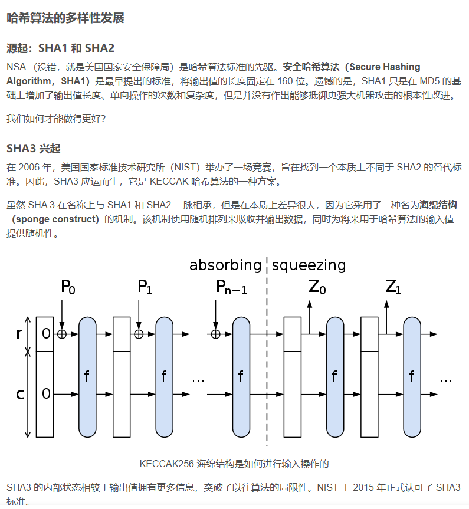
---
### 1. Hash的组成：哈希函数、哈希表和哈希冲突，装载因子与扩容；
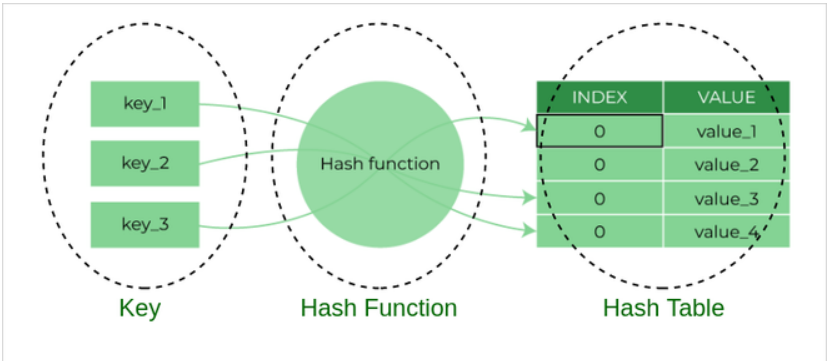
---
### 2. 哈希函数：
哈希函数是Hash的核心组成部分，它的作用是将任意长度的Key（如字符串、数字等）转化为固定长度的输出，这个输出被称为哈希值或哈希码，通常表示为一系列的字符或数字。
哈希函数的选择对于哈希表的性能至关重要。一个理想的哈希函数应该能够将输入数据均匀地映射到哈希表的各个位置，以最小化哈希冲突。
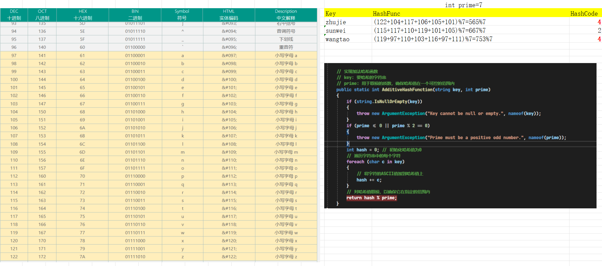
---
### 3. 哈希冲突：
指的是不同的键（Key）经过哈希函数处理后产生了相同的哈希码（Hash Code）；
### 4. 哈希冲突的原因
1. 哈希函数的设计限制：
    哈希函数需要将任意长度的输入映射到固定长度的输出。由于输出空间的有限性（即哈希码的可能值数量有限），当输入空间足够大时，必然会有不同的输入产生相同的输出。
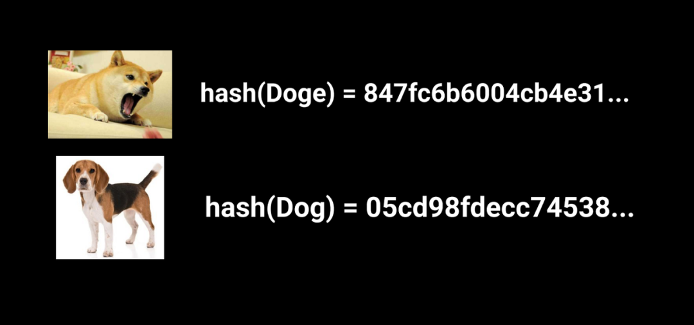
---
1. 数学原理：
    根据鸽巢原理（Pigeonhole Principle），如果有n=9个鸽巢和n+1只鸽子，那么至少有一个鸽巢中会有两只鸽子。类似地，在哈希表中，当输入键的数量超过哈希码空间的大小时，就会发生哈希冲突。

---
1. 哈希函数的碰撞率：
    即使哈希函数设计得再好，也无法完全避免哈希冲突。不同的哈希函数具有不同的碰撞率，即产生哈希冲突的概率。
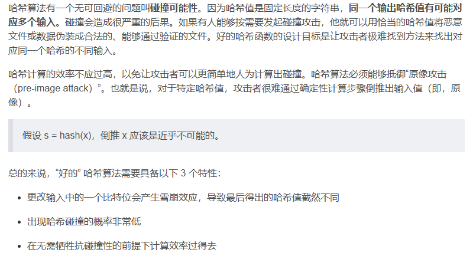
---
### 5. 解决哈希冲突的方法：
####    链表法（在.NET Framework中）
简易ASSCI加法哈希函数的冲突解决；
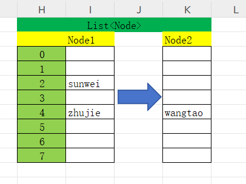
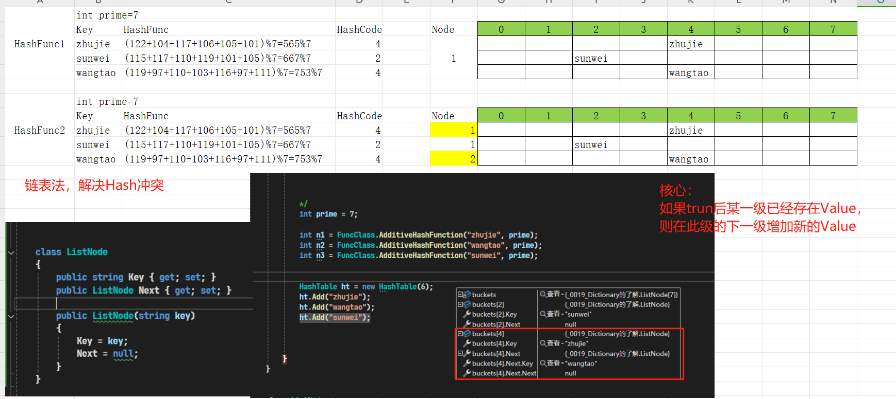
####    红黑树法（在.NET Core 3.0及以上版本中，当链表过长时）
**什么是红黑树**
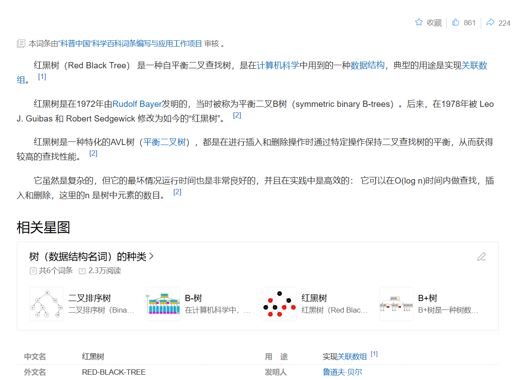
---
**红黑树的图例**
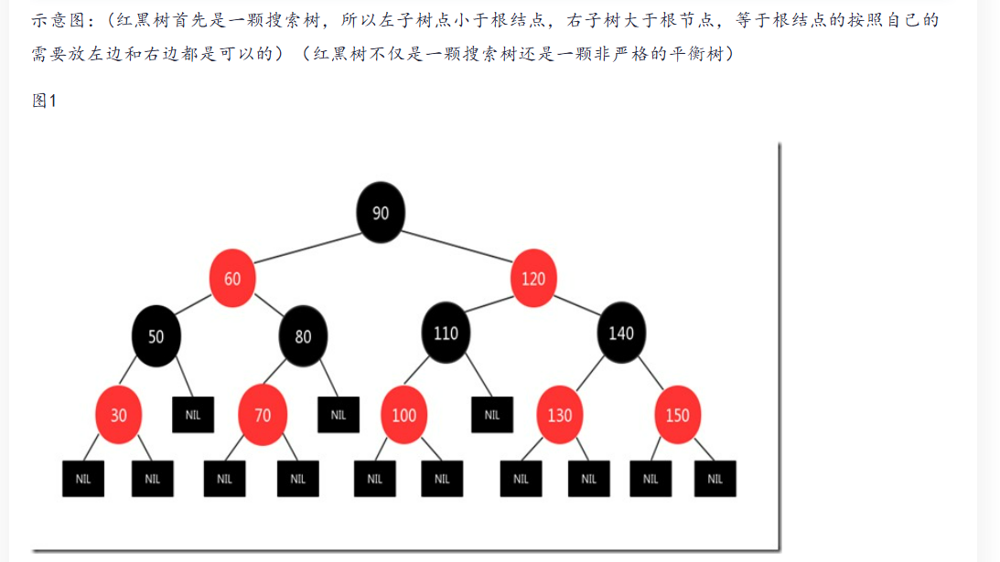
> 注：红黑树是一种自平衡二叉查找树，它通过在插入和删除节点时调整树的平衡来保持时间复杂度为O(logN)。
---
**红黑树的特性**
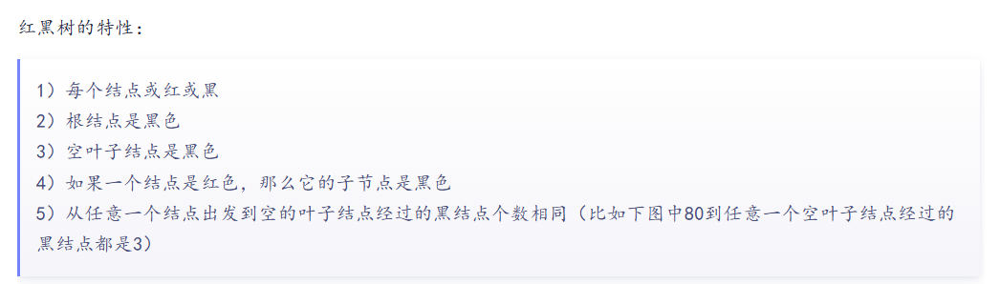
---
**错误的红黑树示例**
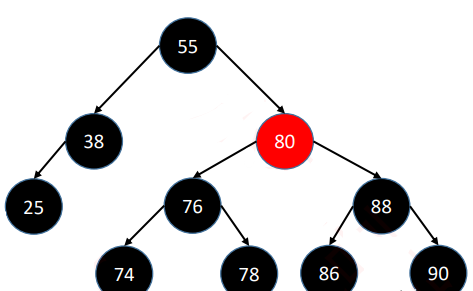
---
**错误的红黑树示例图解**
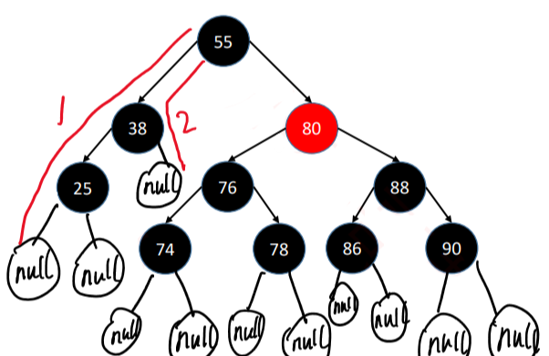
---
**红黑树的基本操作之旋转**
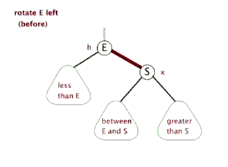

---
**红黑树的基本操作之插入**
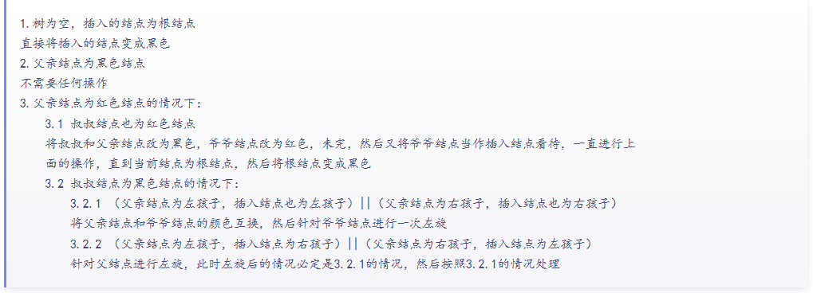
---
**红黑树的基本操作之删除**
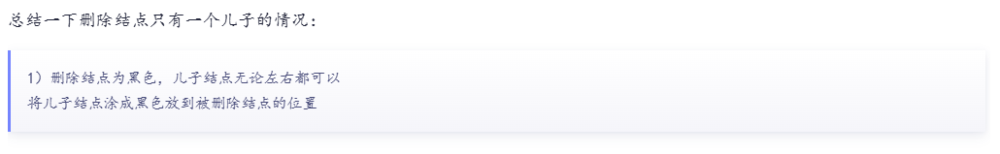
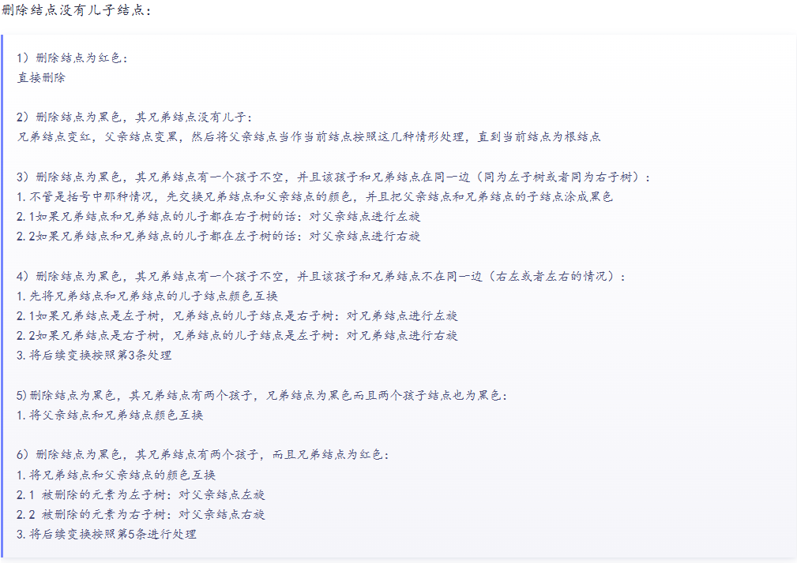
---
##  五、Dictionary的性能优化
### 线程安全
Dictionary在C#中不是线程安全的。这意味着在多线程环境下，如果有多个线程同时对Dictionary进行读写操作，就可能导致数据不一致、损坏或其他不可预测的行为。为了避免这些问题，开发者需要采取额外的同步措施来确保线程安全。
    解决方案：
   1. 使用锁（Lock）：可以在访问Dictionary时使用lock语句来确保同一时间只有一个线程能够操作它。这种方法简单有效，但可能会降低并发性能。
   2. 使用ConcurrentDictionary：.NET Framework 4.0及以上版本提供了ConcurrentDictionary<TKey, TValue>类，它是线程安全的，并且设计用于高并发场景。ConcurrentDictionary内部使用了复杂的同步机制来确保数据的一致性和操作的原子性，而无需开发者手动加锁。
### 内存管理
1. 初始分配：
    当创建一个新的Dictionary实例时，会为其内部的哈希表分配一定大小的内存空间。这个初始大小取决于构造函数的参数或默认设置。
2. 扩容：
   当Dictionary中的元素数量超过负载因子所允许的最大值时，会触发扩容操作。扩容过程中，会创建一个新的更大的哈希表，并将原有哈希表中的元素重新散列到新表中。这个过程需要消耗额外的内存，并且可能会导致短暂的性能下降。为了避免频繁的扩容操作，可以在创建Dictionary时指定一个足够大的初始容量。
3. 元素删除时的内存释放：
   当从Dictionary中删除元素时，被删除元素所占用的内存并不会立即被释放回操作系统。相反，这些内存会被标记为可回收，并在后续的垃圾回收过程中被回收。因此，删除操作并不会立即减少Dictionary的内存占用。

### 选择合适的键类型
1. 尽量使用不可变类型（如int、string、Guid等）作为键，以确保键的哈希码在对象的生命周期内保持不变。
2. 避免使用自定义的可变类型作为键，因为它们的哈希码可能会在对象被修改后发生变化，导致Dictionary行为异常。
3. 如果使用自定义类型作为键，请确保重写GetHashCode()和Equals()方法，以提供稳定的哈希码和正确的相等性比较。

### 哈希冲突的优化方向-哈希函数的选择
1. 哈希冲突会增加查找、插入和删除操作的时间复杂度。因此，选择一个能够均匀分布哈希码的哈希函数至关重要。
2. 在自定义类型中重写GetHashCode()时，应结合对象的所有关键字段来生成哈希码，以减少冲突的可能性。
3. 可以考虑使用组合哈希技术（如XORing字段的哈希码）来进一步提高哈希码的分散性。