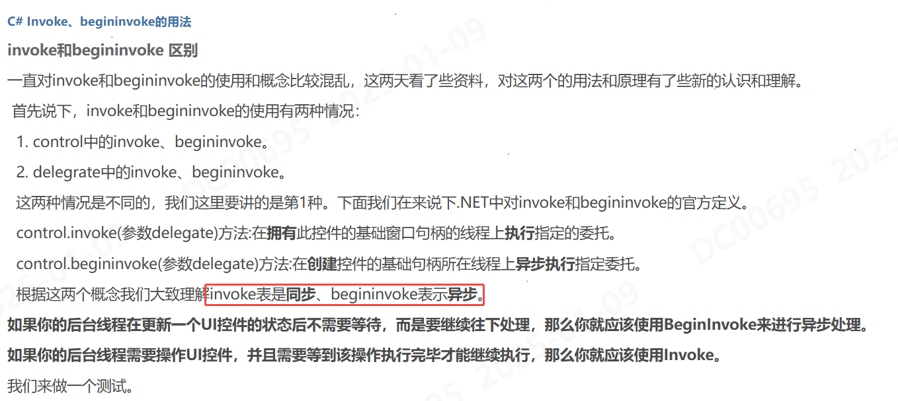
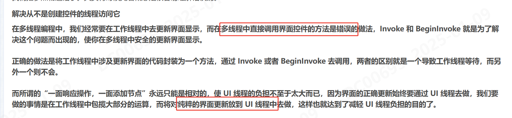
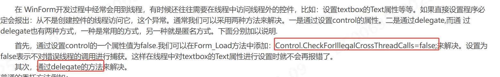

## 参考文章
[博客园](https://www.cnblogs.com/ybqjymy/p/14281286.html)

## 大致内容



```CSharp
// 示例1
delegate void SafeSetText(string strMsg);
private void SetText2(string strMsg)
{
　　SafeSetText objSet = delegate(string str)
   {
       textBox1.Text = str;
   }
   textBox1.Invoke(objSet,new object[]{strMsg});
}
// 示例2
Invoke(() =>
{
    button.Text="关闭";
});
```