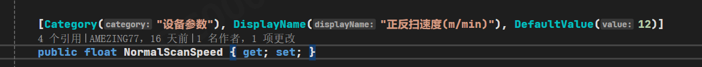
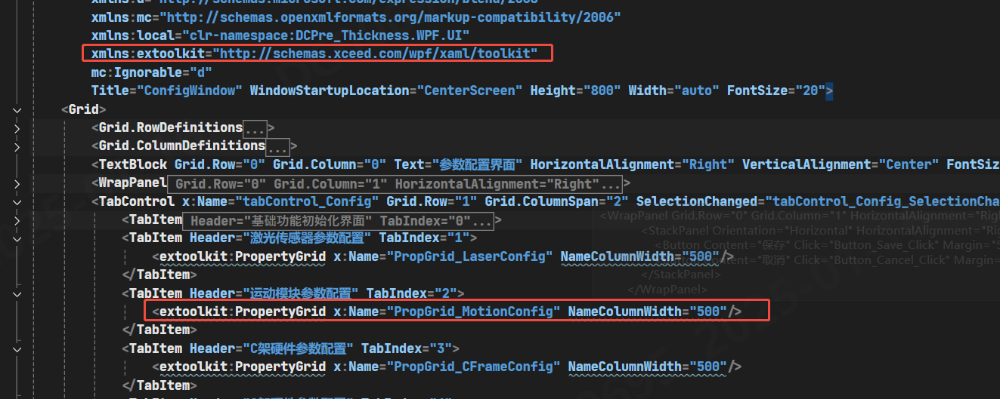
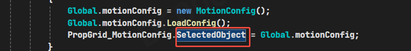
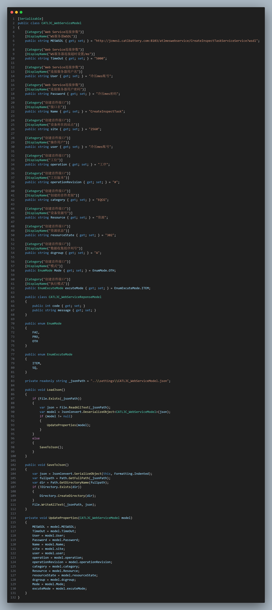
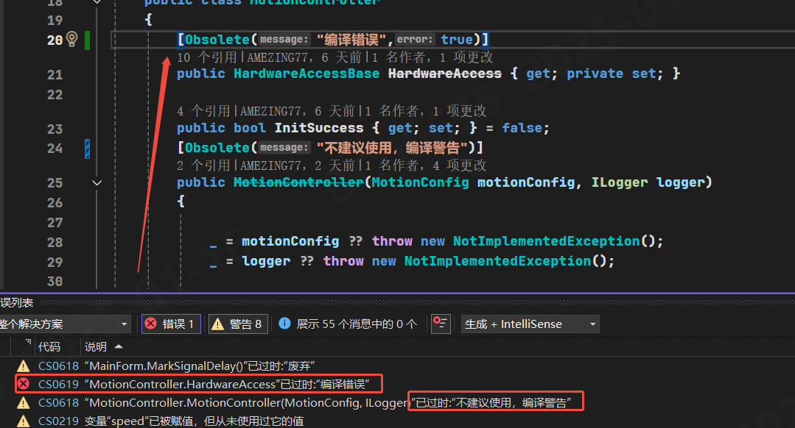

## Category/Description/DefaultValue Attribute 搭配PropertyGrid使用
### WPF的 Xceed.Wpf.Toolkit 的
**`DefaultValueAttribute`在toolKit中可以直接赋默认值。**

### System.Windows.Forms.PropertyGrid 与DevExpress.XtraVerticalGrid.PropertyGridControl

**`DefaultValueAttribute`无法赋默认值，只能通过属性默认值来赋值。**

## ObsoleteAttribute
- ObsoleteAttribute 是一个有用的特性，用于标记不推荐使用的程序元素，并提醒开发人员使用替代方案。
- 通过提供有意义的消息，可以帮助开发人员更好地理解为什么某个元素已过时以及应该使用什么替代方案。
- 通过设置 ObsoleteAttribute 的第二个参数为 true，可以强制编译器在使用过时的程序元素时生成错误，从而确保代码库的质量和一致性。

## UidPropertyAttribute
在 WPF（Windows Presentation Foundation）中，UidProperty 属性用于指定一个属性作为元素的唯一标识符（UID）。UID 通常用于本地化和标识元素。UidProperty 特性可以应用于类，以指定哪个属性将用作 UID。