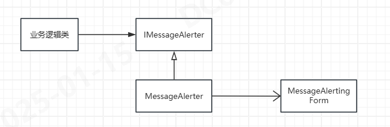

# 大量的MessageBox.Show充斥在业务逻辑中
>使用VS搜索离线测量的代码有500多次MessageBox.Show的调用，造成以下几个问题：
- 在业务逻辑中显示调用messagebox.show非常不合适，业务逻辑应当与UI无关
- 当前许多代码在Task中，messagebox.show会导致所在Task的线程被阻塞，导致线程饥饿问题
- 原生的messagebox.show对多语言非常不友好，无法翻译
- 有许多时候你无法明确方法是否在UI线程还是非UI线程中使用，但代码中几乎没有将调用包裹在Invoke中

为解决此问题，设计以下方式实现



**MessageAlteringForm异步消费MessageAlerter的消费，两者之间通过一个队列做消费传递。此外，增加一层接口抽象，便于业务逻辑类Mocking。**

主要设计如下：
```csharp
public class AlertingMessage
{
    public string Title { get; set; }
    public string Detail { get; set; }
    public int Level { get; set; }
    public DateTime At { get; set; }
    public bool ClearPrev { get; set; }
}

public interface IMessageAlerter
{
    void Alert(AlertingMessage alerting);
    bool TryTake(out AlertingMessage alerting);
}

public class MessageAlerter : IMessageAlerter
{
    private readonly ConcurrentQueue<AlertingMessage> _alerts = new ConcurrentQueue<AlertingMessage>();
    public void Alert(AlertingMessage alerting)
    {
        _alerts.Enqueue(alerting);
    }

    public bool TryTake(out AlertingMessage alerting)
    {
        return _alerts.TryDequeue(out alerting);
    }
}

public class AlertingForm : Form
{
    private readonly CancellationTokenSource _cancellationTokenSource = new CancellationTokenSource();
    public AlertingForm(IMessageAlerter messageAlerter)
    {
        Task.Run(async () =>
        {
            while (!_cancellationTokenSource.Token.IsCancellationRequested)
            {
                try
                {
                    if (messageAlerter.TryTake(out var alerting))
                    {
                        // 根据告警属性进行相应的显示
                        this.Invoke(new Action(() =>
                        {
                            MessageBox.Show(alerting.Detail, alerting.Title);
                        }));
                    }
                    else
                    {
                        await Task.Delay(50, _cancellationTokenSource.Token);
                    }
                }
                catch (OperationCanceledException)
                {
                    // 任务被取消
                    break;
                }
                catch (Exception ex)
                {
                    // 处理其他异常
                    MessageBox.Show($"An error occurred: {ex.Message}");
                }
            }
        }, _cancellationTokenSource.Token);
    }

    protected override void OnFormClosing(FormClosingEventArgs e)
    {
        _cancellationTokenSource.Cancel();
        base.OnFormClosing(e);
    }

}

```
通过这种实现方式可以解决上述的4个问题，特别是没有必要每次都包裹在Invoke中。

以上仅是一个参考实现，可根据具体项目自行增加更多的功能。