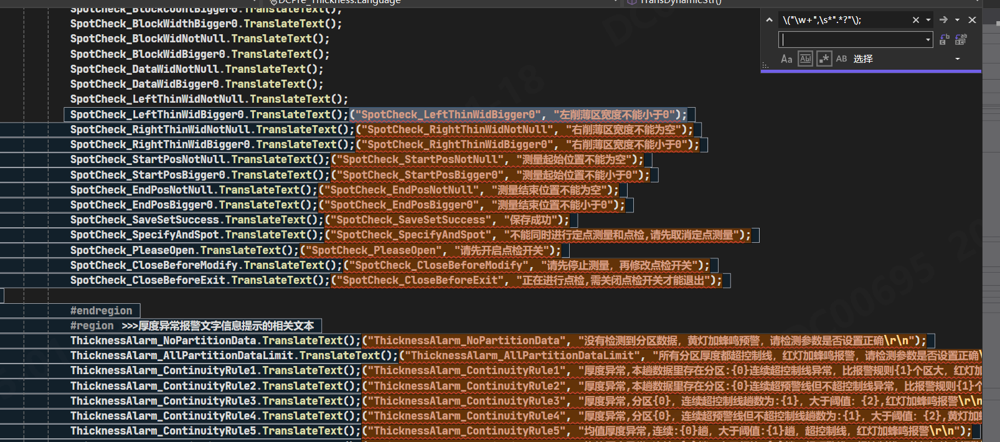
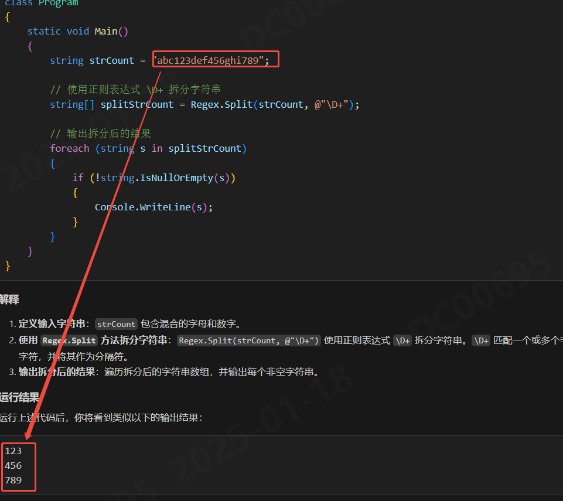

# 常用正则表达式汇总

## 查找("N个字符","N个字符")格式字符串
```Csharp
\("\w+",\s*".*?"\)
```
- `\( 和 \)`：匹配括号 ( 和 )。
- `\w+`：匹配一个或多个字母、数字或下划线（即匹配标识符）。
- `,`：匹配逗号。
- `\s*`：匹配零个或多个空白字符（如空格、制表符）。
- `".*?"`：匹配双引号内的任意字符（非贪婪模式）。


## 切分数字字符串
```Csharp
string[] splitStrCount = Regex.Split(strCount, @"\D+");
```
- `\D+` 表示匹配一个或多个非数字字符，即切分点。
- `+` 表示匹配前面的字符一次或多次。



