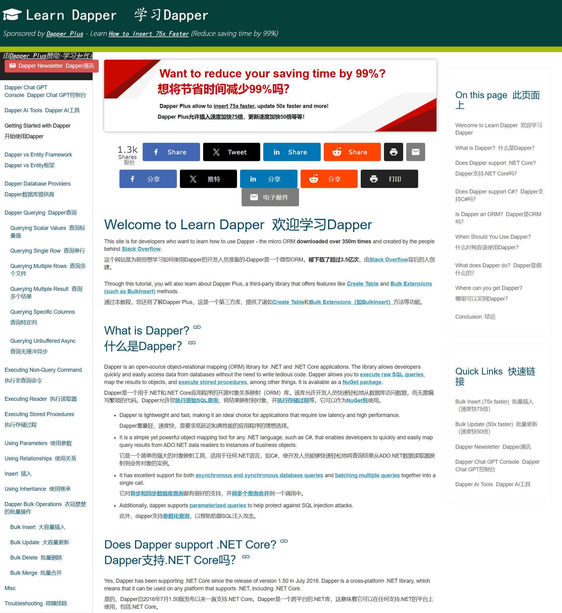
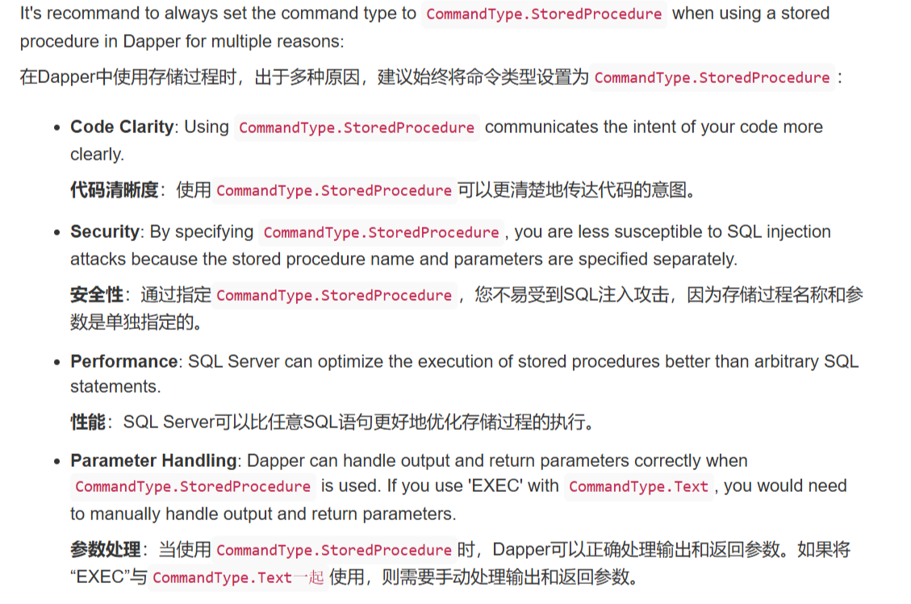

# DapperPlus

- 创建时间: 2025年01月23日 08:57
- Tag: Website
- [Link to Website](https://www.learndapper.com/)


## 简介

## 规范建议


## 优先设计Table对应的类
>一些特性须知
### 标记Annotation
```Csharp
using System;
using System.ComponentModel.DataAnnotations;
using System.ComponentModel.DataAnnotations.Schema;
namespace YourNamespace
{
    [Table("Employees", Schema = "dbo")] // 映射到 "Employees" 表,"dbo"架构
    [Comment("Employees of 2025")] // 设置任意文本注释，从而在数据库中记录架构
    [PrimaryKey(nameof(EmployeeId), nameof(DepartmentId))] // EF Core 7.0 中引入，创建组合键
    public class Employee
    {
        [Key] // 主键
        [DatabaseGenerated(DatabaseGeneratedOption.Identity)] // 插入实体时生成其值
        [Column(Order = 0)]
        public int EmployeeId { get; set; }

        [NotMapped] // 所有具有 Getter 和 Setter 的公共属性都将包含在模型中。可以排除特定属性，使其不被映射到数据库中
        public string JsonPath { get; set; }

        [Required] // 非空
        [MaxLength(50)] // 最大长度
        [Column(Order = 1)]
        public string FirstName { get; set; }

        [Column(TypeName = "datetime2")] // 指定列类型
        [FullName("DateOfBirth")] // 指定列名
        [Precision(3)] // 创建 datetime2(3) 类型的列
        public DateTime DateOfBirth { get; set; }

        [Column(TypeName = "varchar(200)")]
        public string Url { get; set; }

        [Column(TypeName = "decimal(5, 2)")]
        [Precision(14, 2)] // 创建 decimal(14, 2) 类型的列
        public decimal Rating { get; set; }

        [ForeignKey("Department")] // 外键
        public int DepartmentId { get; set; }

        [DatabaseGenerated(DatabaseGeneratedOption.Identity)]//插入实体时生成其值
        public DateTime FirstCreate { get; set; }

        [DatabaseGenerated(DatabaseGeneratedOption.Computed)]//添加或更新时生成其值
        public DateTime LastUpdated { get; set; }

        public Department Department { get; set; } // 导航属性
    }
}
```