[TOC]
# Entity Framework
- 创建时间: 2025年01月23日 11:20
- Tag: Website
- [Link to Website](https://www.entityframeworktutorial.net/)

## EFCore概述
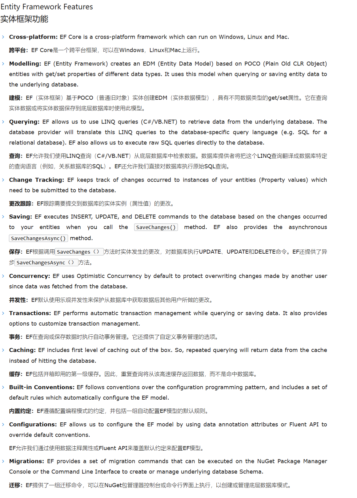
## 基础概念
### ORM是什么
- ORM (Object-Relational Mapper)，对象关系映射器
- EF框架就是一个ORM，使得.Net开发能够直接使用.Net对象操作数据库；
- 适用于数据访问层中与数据库直接交互的部分；
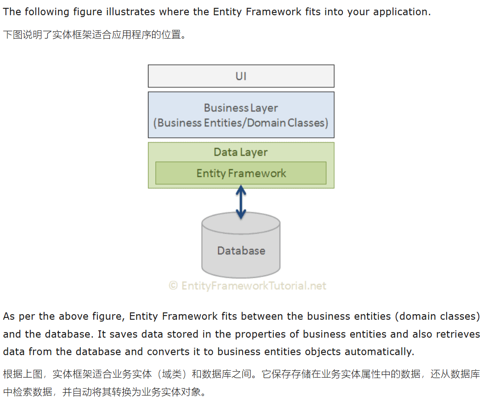
### EF整体架构*

### EF基本工作流
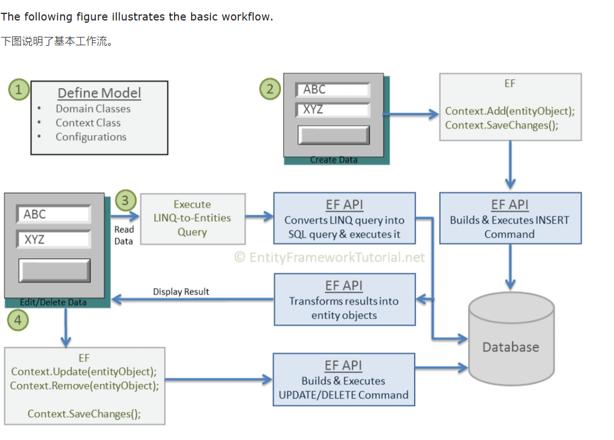
- 其中第三步的Read&display，届时EDM模型的核心Mapper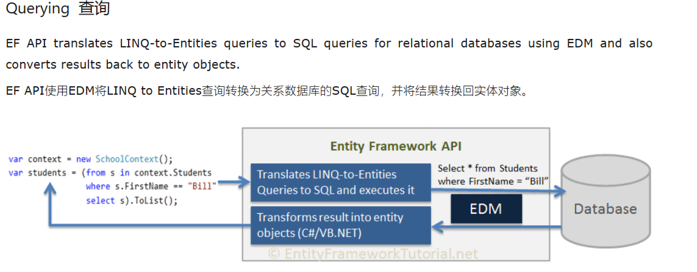
- 第四步修改数据表的操作则揭示`ChangeTracking`和`Saving`
### Entity的定义
- 如何创建Entity
    1. 创建基本类的实体；
    2. 创建派生自DbContext的上下文类；
    3. 以DbSet<基本类名>创建实体集；
- 实体包含两种属性；
    1. `Scalar Property`，基元类型属性称为标量属性。每个标量属性映射到数据库表中存储实际数据的列
    2. `Navigation Property`，导航属性，表示与另一个实体的关系。
- 导航属性有两种类型；
    1. `Reference Navigation Property`，引用导航，实体类A中的某个属性类型是实体类B，对应数据库的表A中新增一个外键列映射表B的主键；
    2. `Collection Navigation Property`，集合导航，实体类A中的某个属性类型是实体类B的泛型集合，对应数据库的表A的主键映射表B的新增的一个外键；
- 实体状态与ChangeTracking
  1. 通常操作都是先查询后执行，这样可以自动追溯实体的变化；
  2. 可以直接修改某个属性的State，减少查询操作，但是不推荐；
  
### 三个First以及DDD是什么
- Database-First

- Code-First

- Model-First
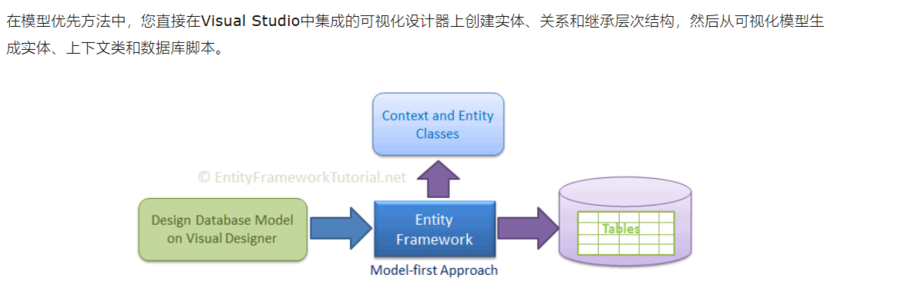
## EFCore高级原理
### IQueryable （延迟执行 && 复用）

- IEnumerable是LINQ的基础，在查询时使用会立即将数据库内容查询到内存中，在分页查找中不适合；
- 但是IQueryable是LINQ的核心，支持延迟执行；
- 若一个方法，返回值是IQueryable类型，就是非立即执行方法（GroupBy 、OrderBy、Include、Skip、Take）；
- 立即执行方法（ToArray 、 ToList 、 Min 、 Max 、 Count）
### 分页查询
- 分页查询的时候有一个问题需要注意，那就是尽量显式地指定排序规则，否则数据库的查询计划对于数据的排序可能是不确定的；

### 性能优化 `AsNoTracking`
- 如果能够确认通过上下文查询出来的对象只是用来展示，`不会发生状态改变`，那么可以使用``AsNoTracking``方法告诉IQueryable在查询的时候“禁用跟踪”
### 全局查询筛选器 `软删除`
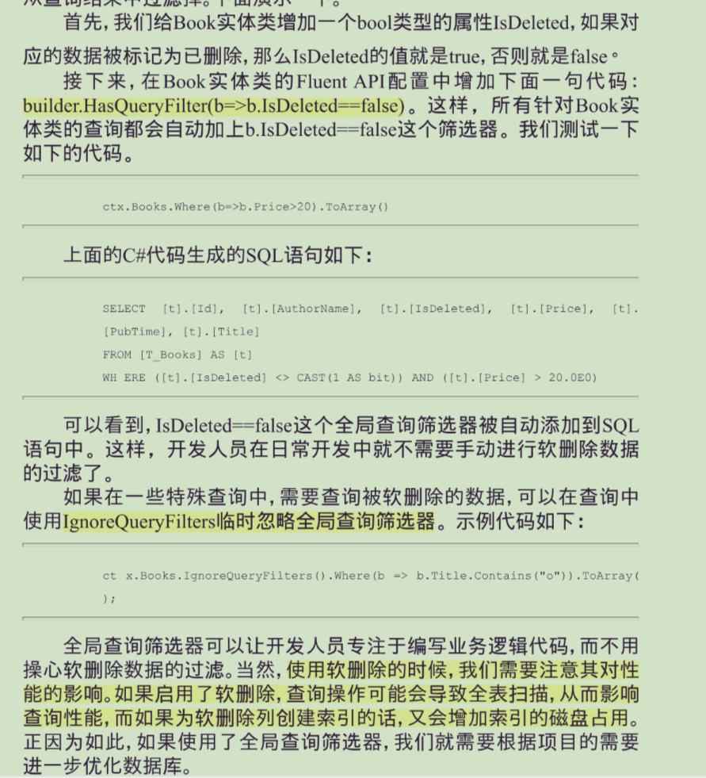

### 悲观锁与乐观锁
- 悲观锁：在数据库层面，通过锁定数据的方式来阻止其他事务对数据的修改；
  1. 悲观锁的实现方式主要有两种：共享锁和排他锁。共享锁允许多个事务同时读取同一资源，但不允许写入；排他锁则只允许一个事务独占访问该资源，直到释放为止。
  2. 悲观锁的优点在于可以有效地防止并发冲突和数据不一致的问题，特别是在高并发的场景下。然而，它也有缺点，比如可能会造成资源的长时间占用，影响系统的性能和吞吐量。因此，在使用悲观锁时需要权衡其利弊，合理选择使用时机。
- 乐观锁：在应用程序层面，通过版本号或时间戳来检测数据是否被其他事务修改过，从而决定是否更新成功。
  1. 乐观锁的实现通常依赖于数据库提供的行级版本控制机制，如SQL Server中的ROWVERSION列或者MySQL中的TIMESTAMP列等。当进行更新操作时，会检查这些字段的值是否有变化，如果有变化说明有其他事务已经更新了这条记录，那么当前的事务就会失败。
  2. 乐观锁的优点是能够减少数据库层面的锁竞争，提高系统整体的性能和吞吐量。但是，如果并发冲突频繁发生，乐观锁可能会导致更新失败的情况增多，需要额外的重试机制来处理这种情况。
  3. Guid可以用来很好地实现并发令牌控制（在不支持RowVersion类型的MySQL中，类似的timestamp精度不够）
   

## EFCore
### 应用范围
- EFCore支持跨平台，
  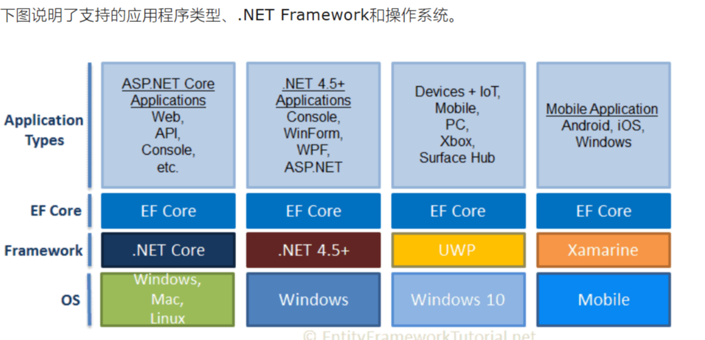
- EFCore对应Nuget包
  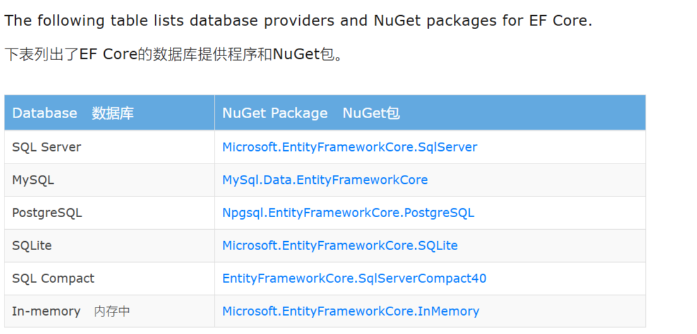

### 初始化操作
#### 创建Entity
- 创建 `domain class`
- 之后需要在DbContext中配置DbSet之后，才能称为实体；
```Csharp
public class Student
{
  public int StudentId { get; set; }
  public string FirstName { get; set; }
  public string LastName { get; set; }

  public int GradeId { get; set; }
  public Grade Grade { get; set; }
}
       
public class Grade
{
  public Grade()
  {
      Students = new List<Student>();
  }

  public int GradeId { get; set; }
  public string GradeName { get; set; }

  public IList<Student> Students { get; set; }
}
```
#### 创建配置DbContext
- 创建一个派生自`DbContext`的上下文类
- 配置实体`DbSet<T>`
- 重载`OnConfiguring()`方法，配置数据库连接字符串
- [Microsoft官方配置](https://learn.microsoft.com/zh-cn/ef/core/dbcontext-configuration/)
- [使用appsettings.json动态配置](https://www.entityframeworktutorial.net/efcore/db-connection-strings.aspx)
```Csharp
public class SchoolContext : DbContext
{       
    //entities
    public DbSet<Student> Students { get; set; }
    public DbSet<Grade> Grades { get; set; }

    protected override void OnConfiguring(DbContextOptionsBuilder optionsBuilder)
    {
        optionsBuilder.UseSqlServer("Server=(localdb)\\mssqllocaldb;Database=SchoolDb;Trusted_Connection=True;");
    }
} 
```
#### 创建Migration
- 需要安装NuGet包 `Microsoft.EntityFrameworkCore.Tools`
- 在PM中执行命令 `Add-Migration InitialCreate`
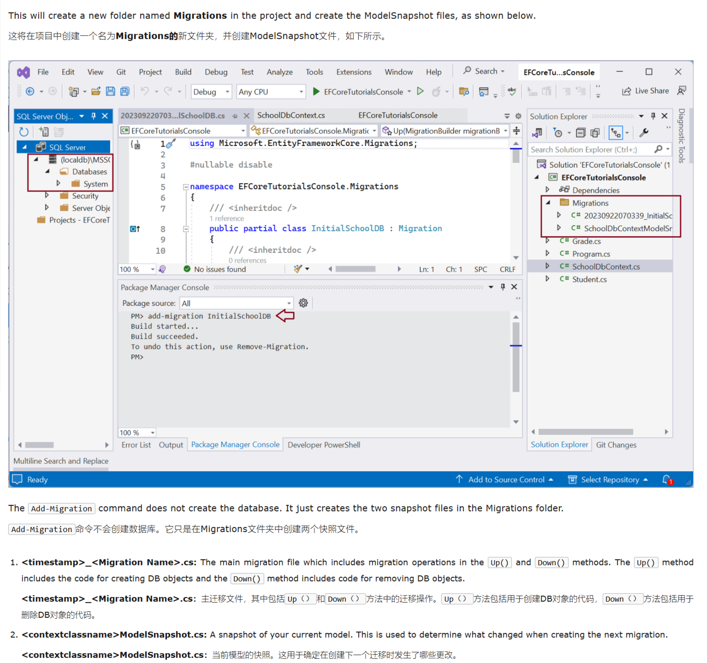
- 创建/更新数据库 `update-database`
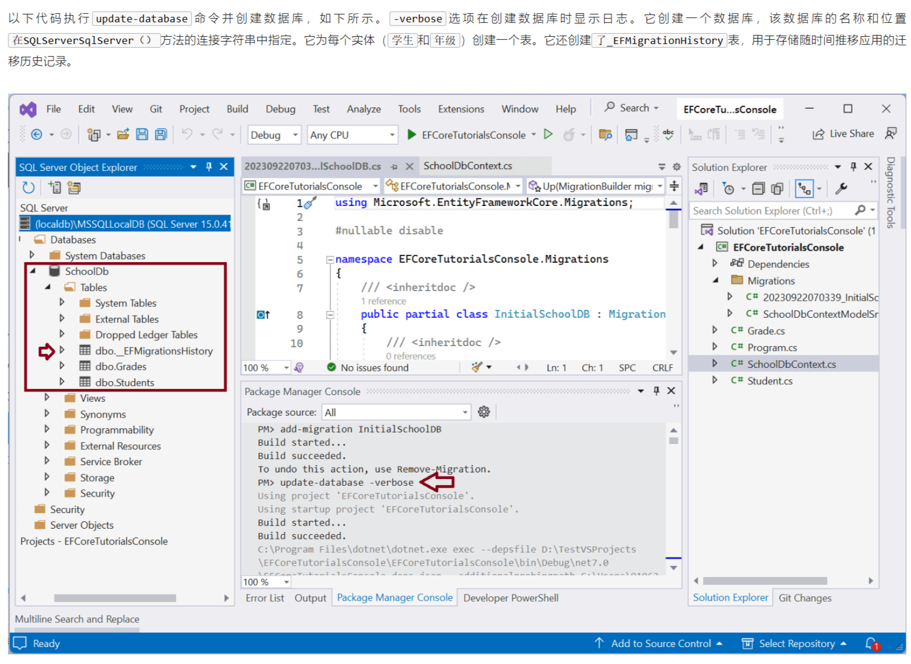
- 为已修改的实体/实体应用迁移 `同上 add & update`
- 回退迁移 `Update-database "已经更新到数据库的指定版本"`
- 删除迁移 `Remove-Migration "未更新到数据库的无用版本"`
- 迁移历史记录 `Get-Migrations`
- 生成迁移脚本 `Script-Migration "迁移版本"` && `generate-migration`


### 数据修改操作
#### 在连接的情况下
```Csharp
using (var context = new SchoolContext())
{
  //增加数据
  var stdAdd = new Student()
  {
      FirstName = "Bill",
      LastName = "Gates"
  };
  context.Students.Add(stdAdd);
  context.SaveChanges();

  //修改数据
  var stdUpdate = context.Students.First<Student>(); 
  std.FirstName = "Steve";
  context.SaveChanges();

  //删除数据
  var stdDelete = context.Students.First<Student>();
  context.Students.Remove(stdDelete);
  context.SaveChanges();
}
```
#### 在断连的情况下
```Csharp
//增加数据
var stdAdd = new Student()
{
    FirstName = "Bill",
    LastName = "Gates"
};
//修改数据
var stdUpdate = new Student()
{
    FirstName = "Steve",
    LastName = "Gates"
};
//删除数据
var stdDelete = stdUpdate;

using (var context = new SchoolContext())
{
  context.Add<Student>(stdAdd);
  context.Update<Student>(stdUpdate);
  context.Remove<Student>(stdDelete);
  context.SaveChanges();
}
```
### 【核心】数据查询
- 结合`Linq to entities` 查询
- `Eager Loading` 贪婪加载
```Csharp
var context = new SchoolContext();
var student = context.Students
              .Where(s => s.FirstName == "Bill")//筛选
              .Include(s => s.Grade)//从Student中导航Grade
              .ThenInclude(g => g.Teachers)//从Grade中导航Teacher
              .FirstOrDefault();
```

### EFCore的默认规则
- 默认情况下，EF Core将在dbo模式中创建所有数据库对象。
- EF Core将在与属性同名的上下文类中为所有DbSet<TIdenty>属性创建数据库表。
- 它还将为`未作为DbSet属性包含但可通过其他DbSet实体中的引用属性访问`的实体创建表。
- 将为实体类的所有标量属性创建与属性同名的列。
- 它使用引用和集合属性在数据库中相应的表之间建立关系。
  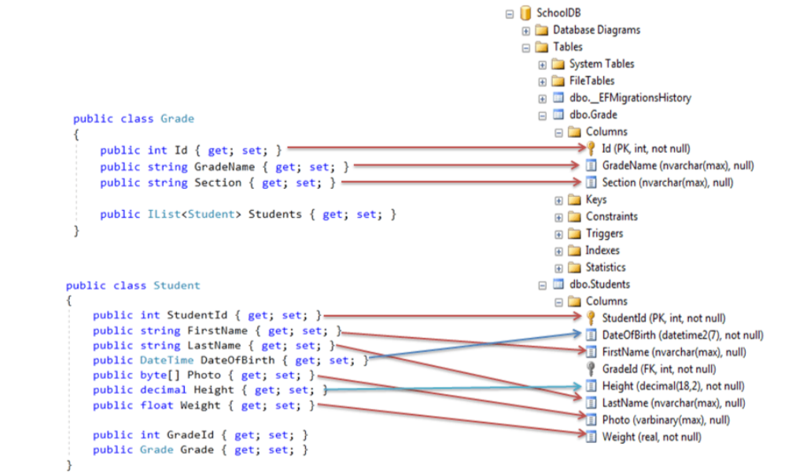
- 将C#数据类型映射到所选数据库的数据类型
  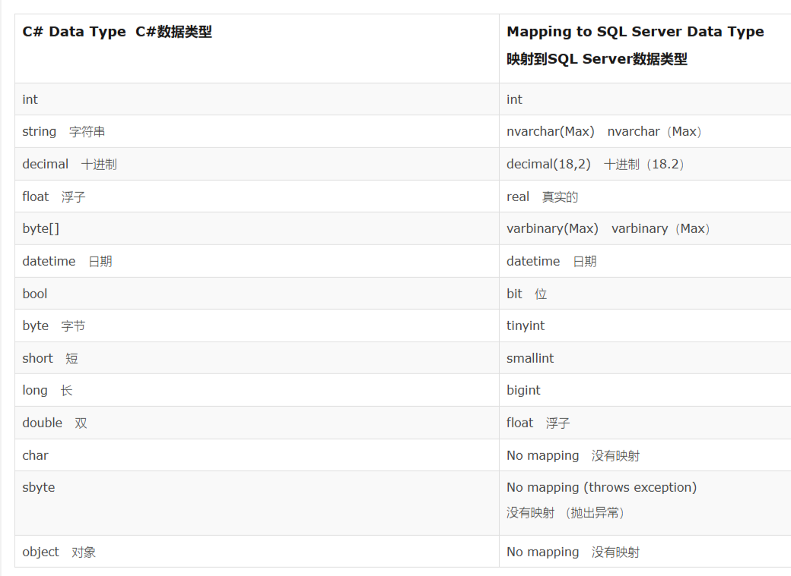
- 为所有引用数据类型和可空基元类型属性（例如string、Nullable、decimal？）创建空列。
- 为所有主键属性和基本类型属性（例如int，float，decimal，DateTime等）创建NotNull列。
- 将为名为Id或<Entity类名>Id（不区分大小写）的属性创建主键列。例如，如果Student类包含名为id、ID、iD、Id、studentid、StudentId、EQUENTID或sTUdentID的属性，EF Core将在Students表中创建一个列作为PrimaryKey。
- 将为实体中的每个引用导航属性创建一个外键列。
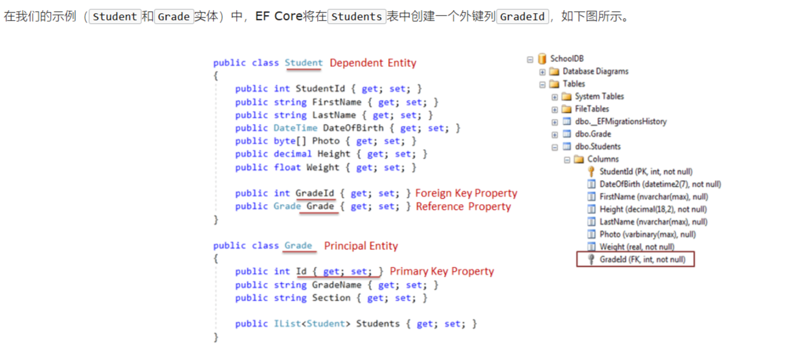
- 默认情况下，EF Core在Primarykey列上创建聚集索引，在ForeignKey列上创建非聚集索引。
  
### 使用FluentApi配置/AnnotationAttributes
- 看书是比较好的选择，理解更清晰
[ASP.NET Core技术内幕与项目实战 基于DDD与前后端分离 (杨中科) (Z-Library)](https://www.kdocs.cn/l/ceRM71oXGg2P)
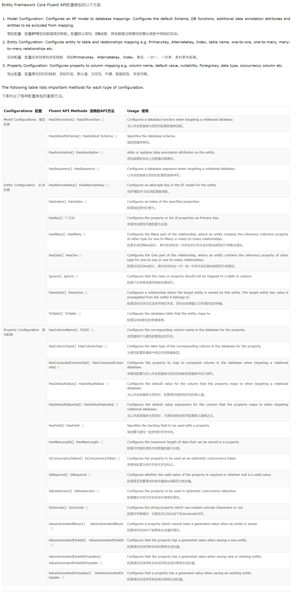
#### 配置一对多关系（非默认生成）
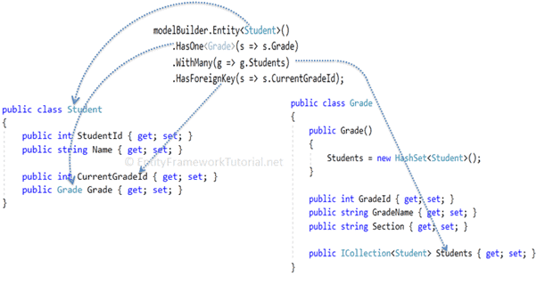
#### 配置 ``级联删除``
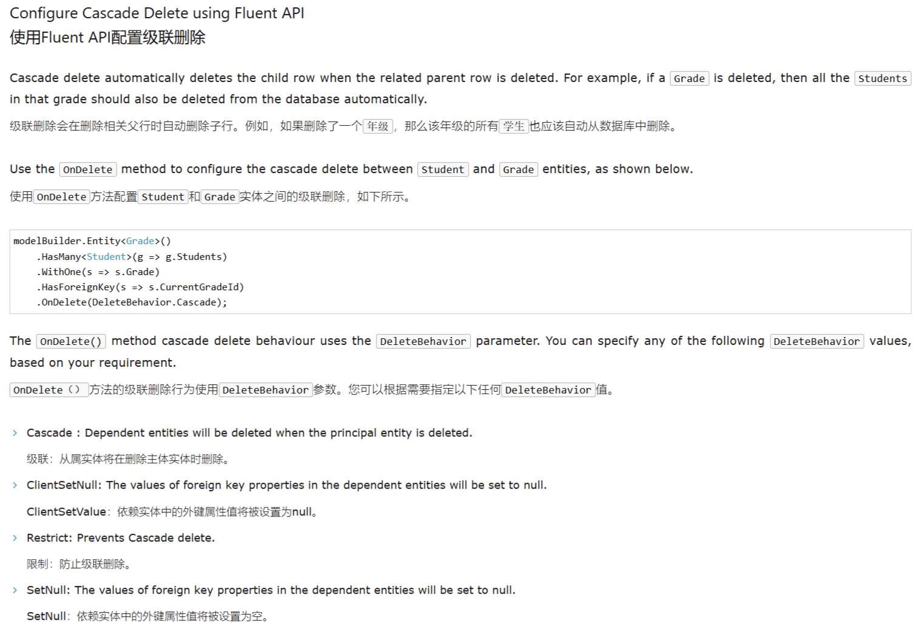
#### 配置一对一关系
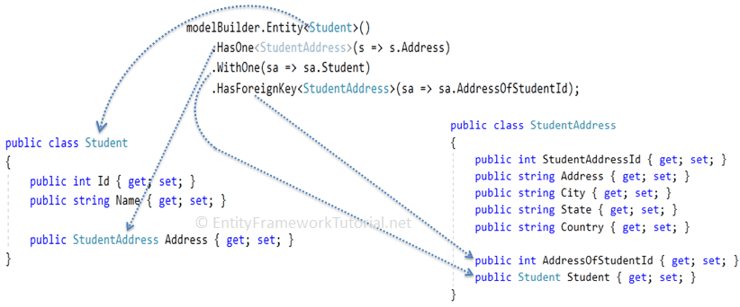
#### 配置多对多关系


### 影子属性（Shadow Property）
- 影子属性是那些没有直接在.NET实体类中定义的属性
- 阴影属性可用于两种情况：
  - 当您不想公开映射实体上的数据库列时。
  - 当您不想公开外键属性，并且只想使用导航属性管理关系时。外键属性将是影子属性，并映射到数据库列，但不会作为实体的属性公开。(In EF Core，如果你没有在实体类中定义外键属性，那么它会自动为其生成影子属性。您不需要手动配置外键属性。
- Defining Shadow Property
```Csharp
protected override void OnModelCreating(ModelBuilder modelBuilder) 
{
  modelBuilder.Entity<Student>().Property<DateTime>("CreatedDate");
  modelBuilder.Entity<Student>().Property<DateTime>("UpdatedDate");
}
```
- 手动访问和修改影子属性
```Csharp
using (var context = new SchoolContext())
{
  var std = new Student(){ StudentName = "Bill"  };  
  // sets the value to the shadow property
  context.Entry(std).Property("CreatedDate").CurrentValue = DateTime.Now;
  // gets the value of the shadow property
  var createdDate = context.Entry(std).Property("CreatedDate").CurrentValue; 
}
```
- 自动插入
>希望在SaveChanges（）方法上自动为这些shadow属性设置值，这样我们就不必在每个实体对象上手动设置它们。因此，在上下文类中重写SaveChanges（）方法;
```Csharp
public override int SaveChanges()
{
  var entries = ChangeTracker
    .Entries()
    .Where(e =>
            e.State == EntityState.Added
            || e.State == EntityState.Modified);

  foreach (var entityEntry in entries)
  {
    entityEntry.Property("UpdatedDate").CurrentValue = DateTime.Now;
    if (entityEntry.State == EntityState.Added)
    {
        entityEntry.Property("CreatedDate").CurrentValue = DateTime.Now;
    }
  }

  return base.SaveChanges();
}
```
- 在所有实体上配置阴影属性
>可以一次在所有实体上配置CreatedDate和UpdatedDate，如下所示。
```Csharp
protected override void OnModelCreating(ModelBuilder modelBuilder)
{
    var allEntities = modelBuilder.Model.GetEntityTypes();

    foreach (var entity in allEntities)
    {
        entity.AddProperty("CreatedDate",typeof(DateTime));
        entity.AddProperty("UpdatedDate",typeof(DateTime));
    }
}
```
### 手动管理EntityState(未完成，有待补充)

### 原始SQL语句
- 简答的语句可以使用，复杂语句还是建议搭配Dapper等ORM工具使用存储过程或视图进行查询。
- 语法
```Csharp
string name = "Bill";
var context = new SchoolContext();
var students = context.Students
                    .FromSql("Select * from Students where Name = '{0}'", name)
                    .OrderBy(s => s.StudentId)
                    .ToList();
```
- 限制


### 使用存储过程(未完成，有待补充)

### 日志记录！！！
- 建议使用第三方库，例如：Serilog，创建一个Logger单例，横穿整个生命周期；
- https://www.entityframeworktutorial.net/efcore/logging-in-entityframework-core.aspx


## DB-First

## Code-First
### DB初始化
#### DB初始化工作流
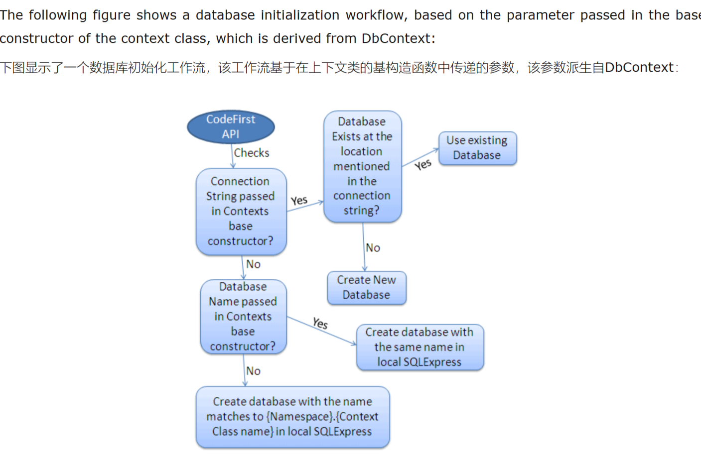
- DB初始化使用的构造函数
  - 无参构造
  - 有参构造（数据库名称）
  - 有参构造（数据库连接字符串，以`name=`开头，可以在app.config中配置）
  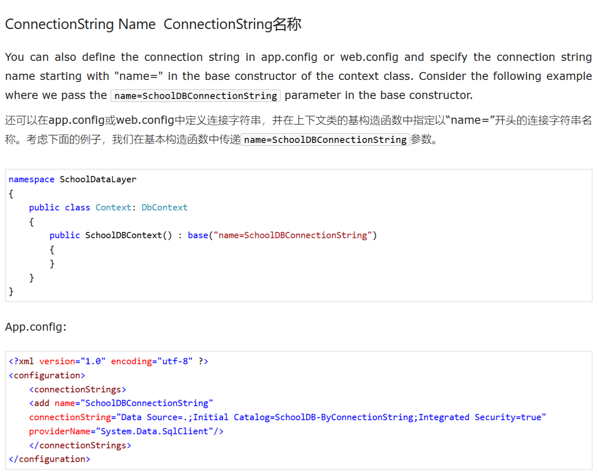
#### 初始化策略
在第一次运行Code-First应用程序后，您已经创建了一个数据库，那么第二次运行之后呢？
它会在每次运行应用程序时创建一个新的数据库吗？
生产环境如何？
当你改变你的域模型时，你如何改变数据库？ 
要处理这些场景，必须使用数据库初始化策略之一。
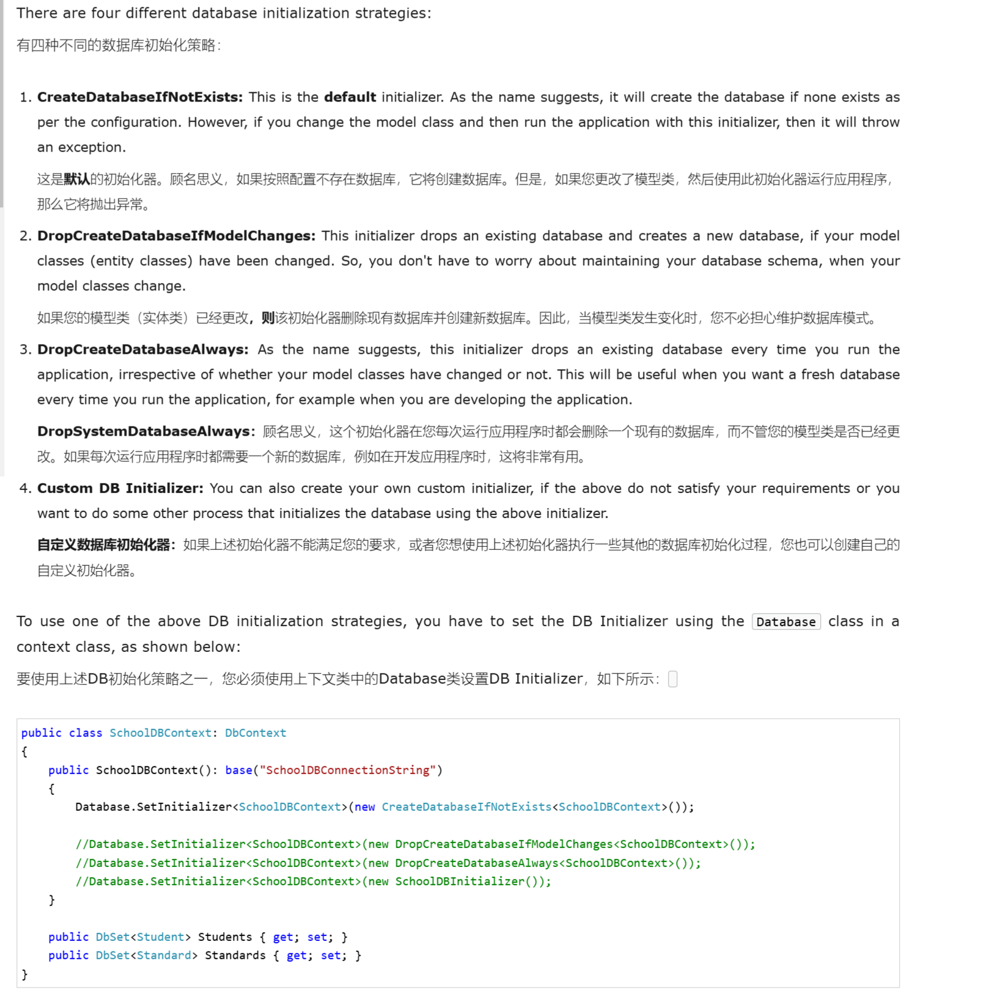

#### 提供Seed数据以供测试


#### Migration 自动与手动迁移

