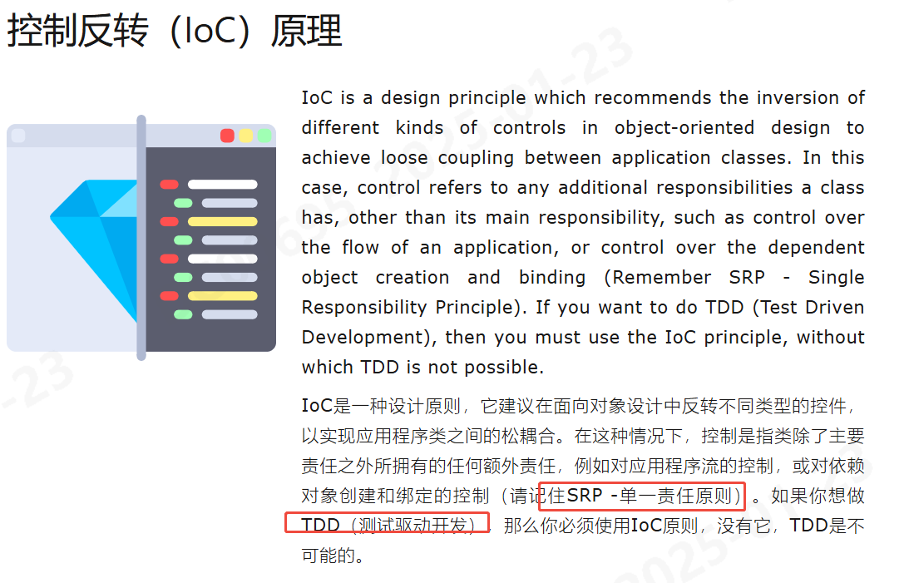
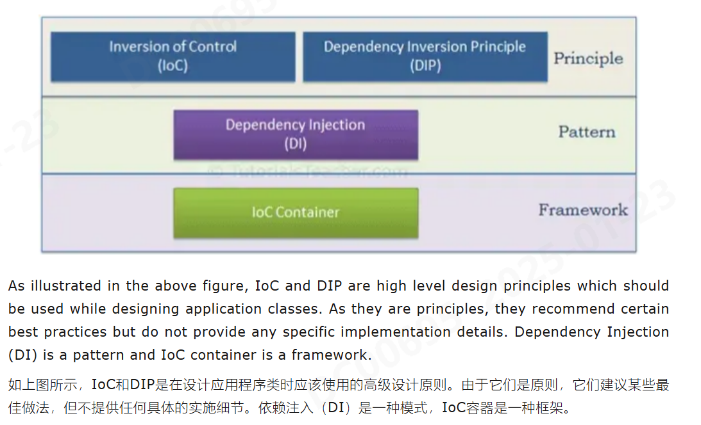
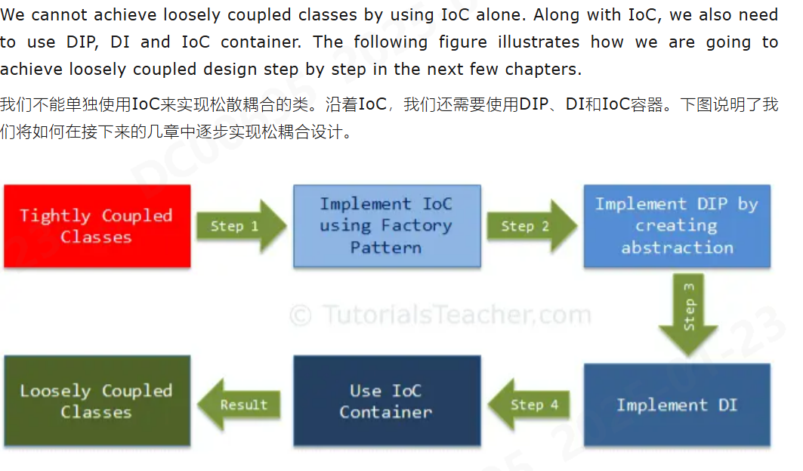
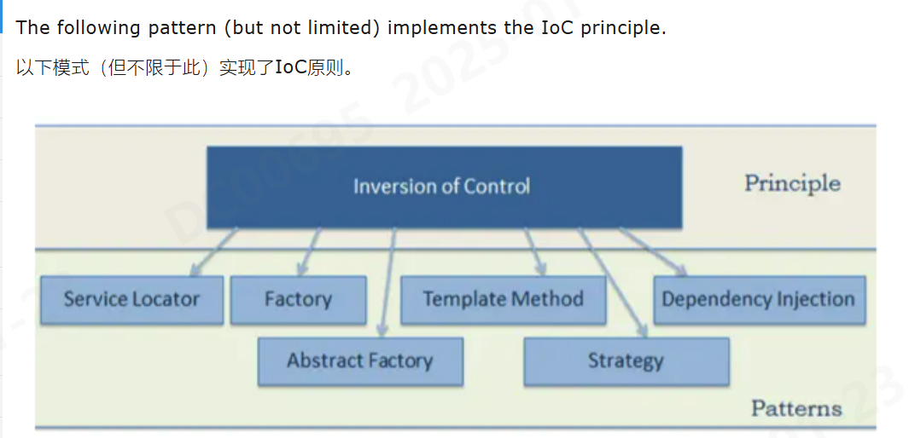
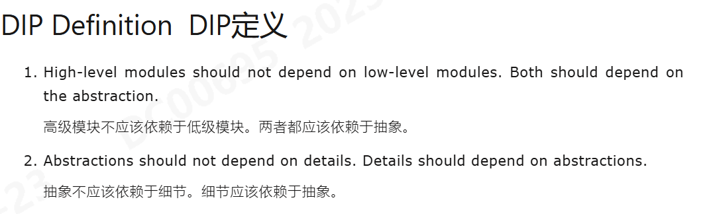
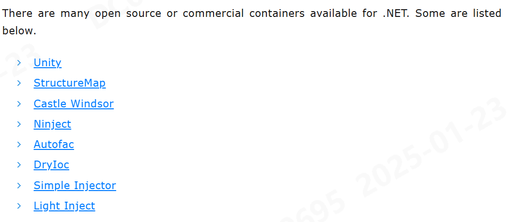
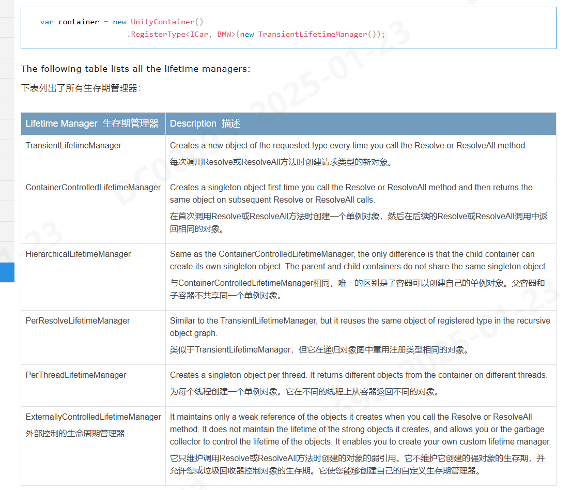

# IOC

- 创建时间: 2025年01月23日 14:24
- Tag: Website
- [Wiki](https://en.wikipedia.org/wiki/Inversion_of_control)
- [Link to Website](https://www.tutorialsteacher.com/ioc)

## 概述
### Ioc/DIP/DI/IocContainer名词解释

### 如何实现TDD

---
### IOC (Inversion Of Control)
- 它用于在面向对象设计中反转不同类型的`控件`，以实现松耦合。
- 控件指的是类除了它的主要职责之外所具有的任何附加职责。
  - 应用程序流的控制
  - 对象创建
  - 依赖对象创建
  - 绑定流的控制
- 实现IOC的几种方式

---
### DIP (Dependency Inversion Principle)

---
### DI (Dependency Injection)
- Constructor Injection  构造函数注入
- Property Injection  属性注入
- Property Injection  属性注入
---
### IoC Container  IoC容器
- IoC容器（又名DI容器）是一个实现自动依赖注入的框架。它管理对象的创建及其生存期，并将依赖项注入类
- 创建指定类的对象，并在运行时通过构造函数、属性或方法注入所有依赖对象，并在适当的时候处理
- 所有容器都必须为后续DI生命周期提供简单的支持
  - Register：容器必须知道在遇到特定类型时实例化哪个依赖。这个过程称为注册。基本上，它必须包含某种注册类型映射的方法。
  - Resolve：使用IoC容器时，我们不需要手动创建对象。容器必须包含一些方法来解析指定的类型;容器创建指定类型的对象，注入所需的依赖项（如果有的话）并返回对象。   
  - Dispose：容器必须管理依赖对象的生存期。大多数IoC容器包含不同的生命周期管理器来管理对象的生命周期并处理它。 
- 常见IoC容器
  

### Unity
- 构造函数注入 `InjectionConstructor`
- 属性注入 `Dependency`
- 方法注入 `InjectionMethod`
#### 生命周期管理
