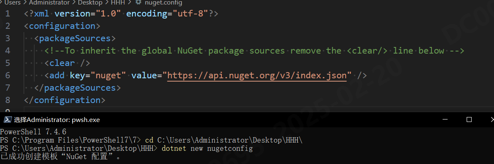
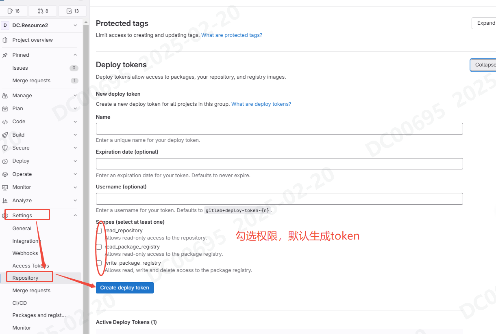
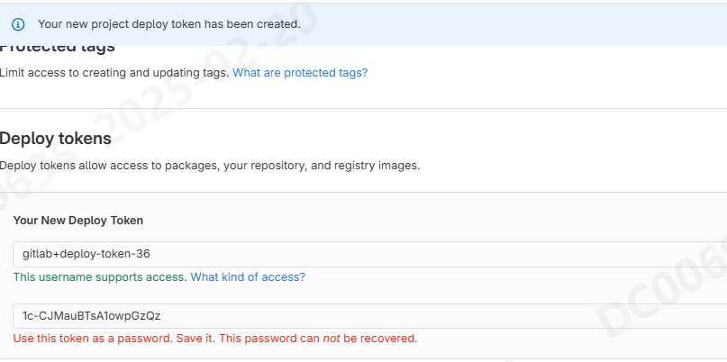

# Nuget与Gitlab，拉包与发包（手动）
[参考gitlab官方文档](https://docs.gitlab.com/)
## 拉包
### 如何为本地程序配置nuget.config
- 为了访问内部部署的远端仓库，需要部署nuget.config文件
- 文件内包含远端仓库的地址、用户名、密码等信息
- 以下为完整实例
```Csharp
<?xml version="1.0" encoding="utf-8"?>
<configuration>
	<packageSources>
        <clear />
		<!--公共包源，一些公共类库可以从里面下载-->
		<add key="nuget.org" value="https://api.nuget.org/v3/index.json" protocolVersion="3" />
		<!--关于该包的项目编号，gitlab目前支持以项目编号来发布包-->
		<add    key="project" 
                value="http://192.168.4.109/api/v4/projects/183/packages/nuget/index.json" 
                allowInsecureConnections="true" />
		<!--conmmon组号-->
		<add    key="group" 
                value="http://192.168.4.109/api/v4/groups/49/-/packages/nuget/index.json" 
                allowInsecureConnections="true" />
	</packageSources>
	<packageSourceCredentials>
		<!--上面配置的key = gitlabProject的Token，可以理解为账户密码，这样发布包的时候不用再输入了-->
		<project>
			<add key="Username" value="gitlab+deploy-token-35" />
			<add key="ClearTextPassword" value="abykGMSFeFHRv455xUfU" />
		</project>
		<!--上面配置的key = gitlab的Token，可以理解为账户密码，这样发布包的时候不用再输入了-->
		<group>
			<add key="Username" value="gitlab+deploy-token-1" />
			<add key="ClearTextPassword" value="dniEuB56rCTHD_jcjXU4" />
		</group>
	</packageSourceCredentials>
</configuration>
```
### 使用PowerShell生成config文件
```CSharp
dotnet new nugetconfig//在当前目录下生成nuget.config文件
```


### 具体配置
- 包源配置
  - 在`packageSources`中添加多个包源
  - key为包源的名称，可在nuget包管理器中看到，value为包源的地址
  - 其中`allowInsecureConnections="true"`表示允许不安全的连接，即不使用https
- 包源凭证
  - 在`packageSourceCredentials`中添加多个包源凭证
  - 其中对应前面的Key，添加用户名和密码
  
- 将生产的token复制到nuget.config中，与项目绑定
  


