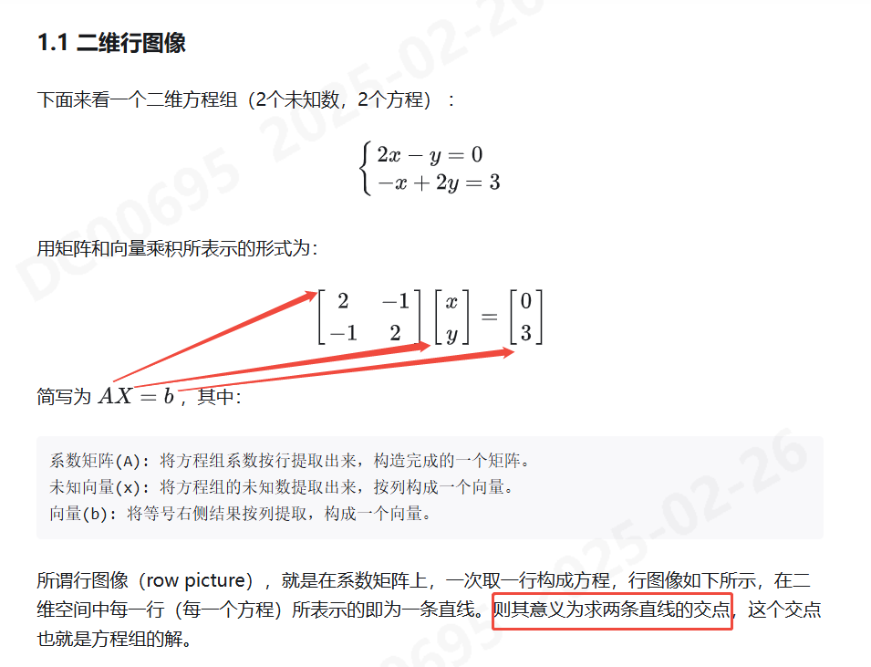
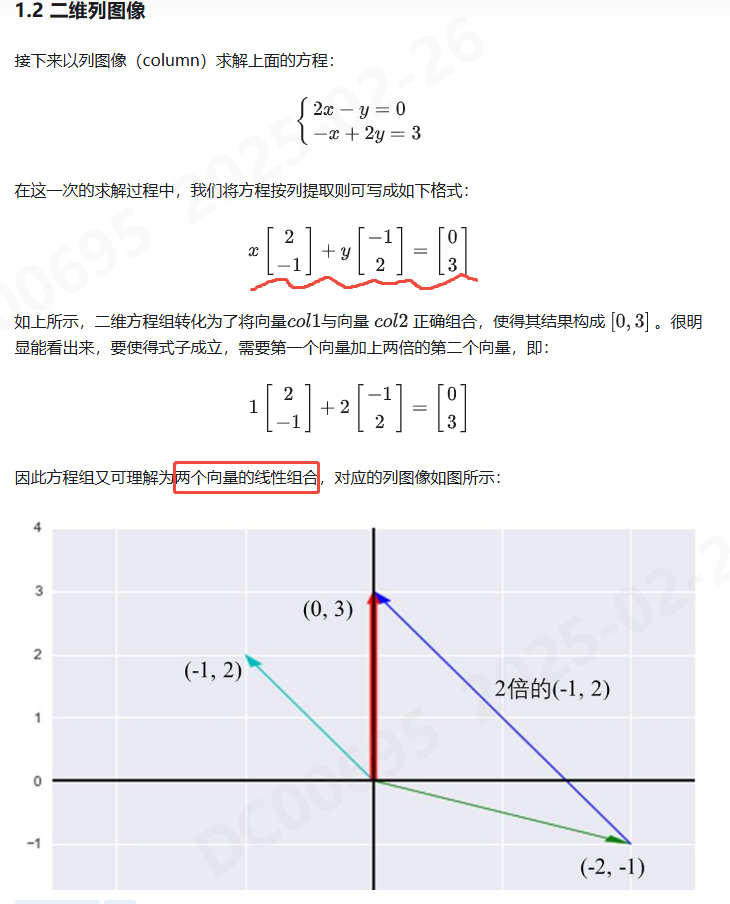
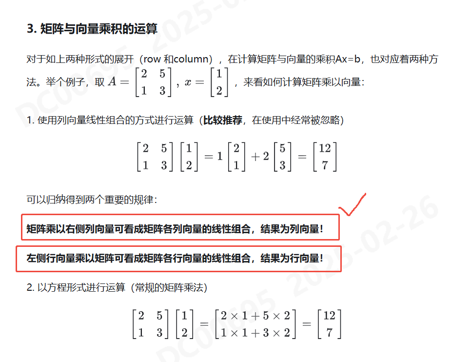
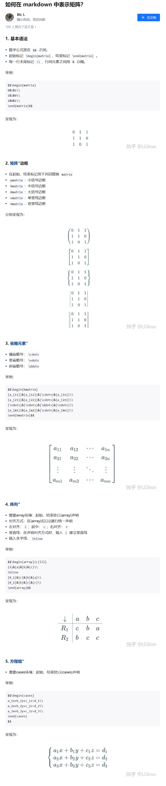

# 线性代数

- 创建时间: 2025年02月26日 17:24
- Tag: Website
- [Link to Website](https://www.bilibili.com/video/BV16Z4y1U7oU/)

## 内容概述
### 多元方程的几何解释
- 行向量，理解是两条直线的交点；
- 矩阵A*变量x=结果b

- 列向量，理解是两个向量相加

- 多维矩阵

### 矩阵消元
#### 矩阵的Markdown表示

#### 注意点
- 矩阵的乘法顺序不能改变，AB!=BA
#### 消元法
#### 回代
#### 单位矩阵
$$\begin{bmatrix}
1&0&0\\
0&1&0\\
0&0&1\\
\end{bmatrix}$$
#### 置换矩阵
$$\begin{bmatrix}
0&0&1\\
0&1&0\\
1&0&0\\
\end{bmatrix}$$
- 当`行`变化时，`左乘`一个置换矩阵
- 当`列`变化时，`右乘`一个置换矩阵

### 乘法和逆矩阵
#### 矩阵乘法
- 矩阵乘法不满足交换律
- 矩阵乘法满足结合律
- 矩阵乘法满足分配律
- `M*N`的矩阵A 乘以 `N*P`的矩阵B，得到 `M*P`的矩阵C
- 