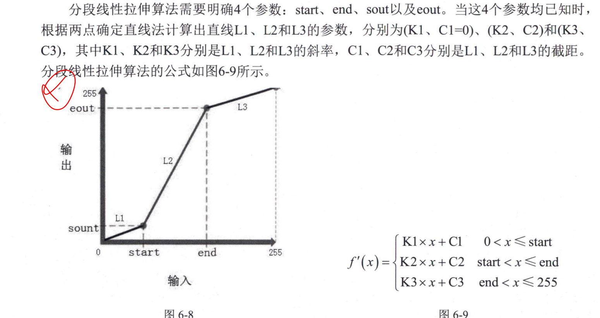

[TOC]
# 计算机视觉

- 创建时间: 2025年03月02日 10:50
- Tag: Wpsbook


## OpenCV4.5 计算机视觉开发实战 基于python
### 计算机视觉概述
#### 图像的基本概念
- 像素（Pixel）
  - 图像的最小单位，每个像素包含颜色信息；
- 图像分辨率（Resolution）
  - 图像的分辨率指的是图像在水平和垂直方向上的像素数量；
- 屏幕分辨率（Screen Resolution）
  - 屏幕分辨率指的是屏幕上水平和垂直方向上的像素数量；
- 灰度
  - 灰度图像的每个像素值介于0到255之间，表示从黑到白的亮度；
- 灰度级
  - 灰度级指的是图像中不同的亮度级别数量；
  - 有时把最大灰度级数称为灰阶（Gray Levels）；
- 深度
  - 图像的深度指的是每个像素能存储的颜色通道数；
  - 计算一个相机单次采集的数据量，分辨率*深度；
  - 1MB=1024KB，1KB=1024Byte，1Byte=8bit；
  
- 二值图像
  - 二值图像的每个像素只能是0或1，表示黑和白，用1bit存储；
- 灰度图像 Gray Scale Image
  - 灰度图像的每个像素值介于0到255之间，表示从黑到白的亮度；
  - 灰度图像只包含一个通道的信息
- 彩色图像 RGB Image
  - 彩色图像的每个像素包含三个颜色通道，分别是红色、绿色和蓝色，从0到255之间；
- 通道
  

---
---
#### 图像噪声
- 噪声种类
  - 高斯噪声、瑞利噪声、伽马噪声、脉冲噪声等；
  - 脉冲噪声也叫椒盐噪声，是图像中最常见的一种噪声；
- 噪声来源
  - 外部噪声，主要是电气设备的干扰、天体干扰等；
  - 内部噪声，主要是传感器本身的噪声（电源电压不稳、物理抖动、元器件缺陷）
- 图像滤波
  - 经典平滑滤波方法，对单像素及其局部并行处理，计算效率高；
  - 灰度图像滤波，线性滤波器、非线性滤波器；
    - 线性滤波器：均值滤波、高斯滤波；在平滑的同时，会丢失图像的边缘信息；
    - 非线性滤波器：中值滤波、双边滤波；相对于线性滤波器，可以较好地保持图像的边缘信息；但是是全局滤波，对于未存在噪声的部分会造成模糊；
#### 图像处理
- 图像处理常用方法：
  - 图像变化，图像编码压缩、图像增强、图像复原、图像分割、图像分类、图像重建等；
- 图像增强
  - 图像增强是提高图像质量的过程，包括对比度调整、锐化等，目的是为了去除采集国过程中的噪声或提取感兴趣的区域；
  
- 图像分割
  - 图像分割是提取有意义的图像特征，如边缘、区域等

### OpenCV基本操作
- 架构
  
#### 图像输入输出
- 读取图像`cv.imread()`
  - 支持相对路径和绝对路径，建议使用'/'
  - 
- 读取中文路径
  
- 获取图像的宽高
```python
  height = np.shape(img)[0] 
  width = np.shape(img)[1]
  channels = np.shape(img)[2]
```
- 显示图片`cv.imshow(filename,img)`
- 保存图片`cv.imwrite(filename,img)`
- 创建窗口`cv.namedWindow(windowname)`
  
- 单窗口多图显示`cv.hstack(tuple(img1,img2,img3))`
  - 将多个图像横向拼接起来显示，高度shape[0]必须相同；
- 调整窗口大小`cv.resizeWindow(windowname,width,height)`
  - 注意创建窗口时flag=cv.WINDOW_NORMAL；
- 销毁窗口`cv.destroyAllWindows(windowname)`
- 鼠标事件
  
- 键盘事件
  
- 滑动条事件


### 图像处理模块
#### 颜色变换
- 常见的几种颜色转换
  - 灰度图
    - 将黑色和白色转换为256个灰阶，灰度值介于0到255之间；
  - 二值图
    - 将图像转换为二值图，只有黑白两种颜色；
  - HSV
  
  - YUV
  
- OpenCV中默认读取彩色图像的颜色空间是BGR；
#### 基本图形绘制
- 画点/圆`cv.circle(img,(x,y),radius,color)`
- 画线`cv.line(img,(x1,y1),(x2,y2),color)`
- 画矩形`cv.rectangle(img,(x1,y1),(x2,y2),color)`
- 文字`cv.putText(img,text,(x,y),fontFace,fontScale,color)`

#### 图像轮廓查找


### 灰度变换与直方图修正
#### 点运算
- 点运算指对图像中每个像素进行相同且独立的运算；
- 点运算分为灰度变换和直方图修正两种方法；
- 显示标定，某些显示设备有特定的优选灰度范围；

#### 灰度变换
- 若曝光不足/曝光过度，导致图像对比度过小、输入图像的亮度分量的动态范围较小，可以通过灰度变化来提高图像的对比度，突出感兴趣的特征/抑制无效信息；
- 彩色图像灰度化
  - 加权平均值法
  
  
  - 最大值法`D=Max(B,G,R)`
  - 平均值法`D=Avg(B,G,R)`
- 灰度线性变化
  - 在低曝/过曝情况下，图像的灰度局限在小范围内，采用线性变化可以对指定范围的灰度做拉伸；
  - 分段线性变化将灰度分为多个范围，对感兴趣的特征进行增强；
  - 分段线性需要确认分段点，可以考虑自适应最小误差法、多尺度逼近法、恒增强率
- 非线性变换
  - 对数变换，能增强暗部细节
  
  
  - 伽马变换，多用于高灰度和低灰度的增强
  

#### 直方图修正
- 直方图Histogram,就是描述图片中灰阶出现的次数/概率；
- `cv.calcHist(images,channels,mask,histSize,ranges)`
- 直方图均衡化
  


### 图像平滑
#### 平滑的分类
- 频率域平滑
  - 傅里叶变换，将图像从空间域转换到频率域；
  - 傅里叶变换的逆变换，将图像从频率域转换到空间域；
  - 高频噪声频谱，可以使用低通滤波器；
  - 低频噪声频谱，可以使用高通滤波器；
- 空间域平滑
  - 线性滤波与非线性滤波
  
  - 线性平滑可以降噪，但是模糊了边缘和细节；
  - 非线性平滑可以消除孤立点噪声，但是模糊了边缘；
- 线性滤波方法
  - 归一化/均值滤波`cv.blur(src,ksize)`
  
  - 高斯滤波`cv.GaussianBlur(src,ksize,sigma)`
  
    - 高斯滤波是高斯核与图像卷积，对于服从正态分布的噪声，效果最好；
    - 高斯模糊是通过低通滤波器实现的，可以去除图像中的高频噪声；
- 非线性滤波方法
  - 中值滤波`cv.medianBlur(src,ksize)`
    - size大于1且为奇数，默认为3*3；
    - 对于椒盐噪声（随机出现的白点/黑点），中值滤波效果好；
    - 会丢失图像的边缘信息，带来不必要的模糊；

  - 双边滤波`cv.bilateralFilter(src,ksize,sigmaColor,sigmaSpace)`
    - 双边滤波同时考虑空间距离和像素值差异，可以较好地保持边缘信息；
    - 
    - 运算较慢，可以采用快速双边滤波、双边中值滤波；
    - 通常用较小的sigmaColor和较大sigmaSpace，可以有效去噪并保持边缘；

---
---
### 几何变换


## 概率概述
### 通用概念定义
#### 随机变量 x
- 随机变量是定义在概率空间上的函数，其值可以是连续的也可以是离散的。
- 离散变量`概率和=1`可以是有限的或无限；
- 连续变量`积分=1`可以是有限的或无限的；
#### 离散变量和连续变量的概率分布Pr(x)
- 离散变量的概率分布 直方图
  
- 连续变量概率分布 概率密度函数（PDF）
  
#### 联合概率分布 Pr(x,y)
- 任意多元变量的联合概率分布，Pr(x,y,z,...)

#### 边缘化
- `任意单变量的概率分布都可以通过联合概率分布求其他变量的和（离散）或积分（连续）而得到`；
- 其他变量的积分/求和过程称为边缘化（Marginalization）；
- 
#### 条件概率分布 Pr(x|y)
- 给定`| y=10 `其他变量的情况下，一个变量的概率分布；
- 公式：Pr(x|y)=Pr(x,y)/Pr(y)
  
#### 贝叶斯公式

#### 独立性
- 独立：从变量x不能获得变量y的任何信息，反之亦然；
- 两个变量独立，则它们的联合概率分布等于各自的概率乘积；

#### 期望
- 期望：大量样本x*对应的函数F(x)输出结果之和的平均值；


### 习题练习


## 常用概率分布

### 介绍

#### 伯努利分布

#### 贝塔分布

#### 分类分布

#### 迪利克雷分布
、
#### 一元正态分布

#### 正态逆伽马分布

#### 多元正态分布

#### 正态逆维希特分布

#### 共轭性

