[TOC]
# C++

- 创建时间: 2025年05月20日 23:12

## 基础知识点
### 隐式转换与explict关键字
- **explict**放在构造函数前，阻止隐式转换，必须显式调用
- 隐式转换的例子

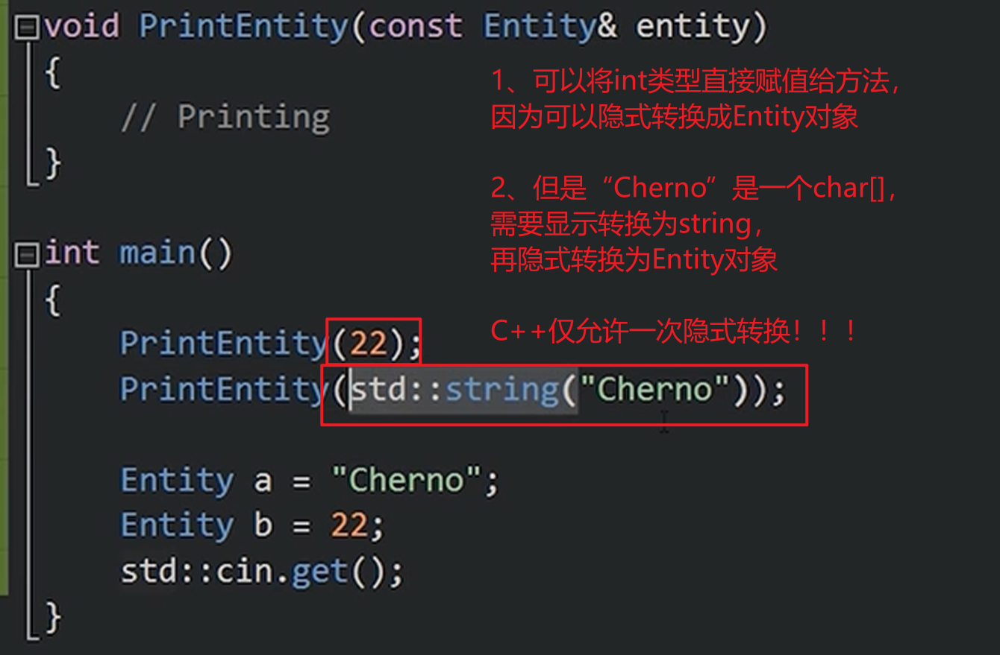

### 运算符及其重载
- 尽量不建议重载运算符，除非有特殊需求
- 重载 **+** 运算符
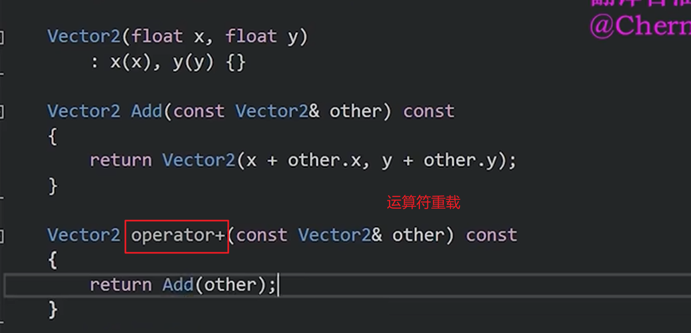
- 重载 **<<** 运算符
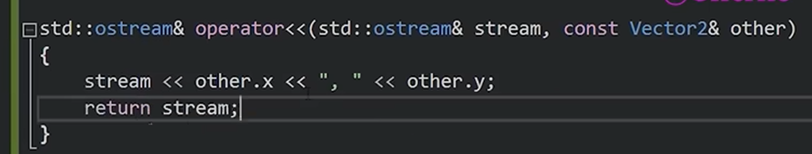

### this关键字
- 指向此对象实例的指针
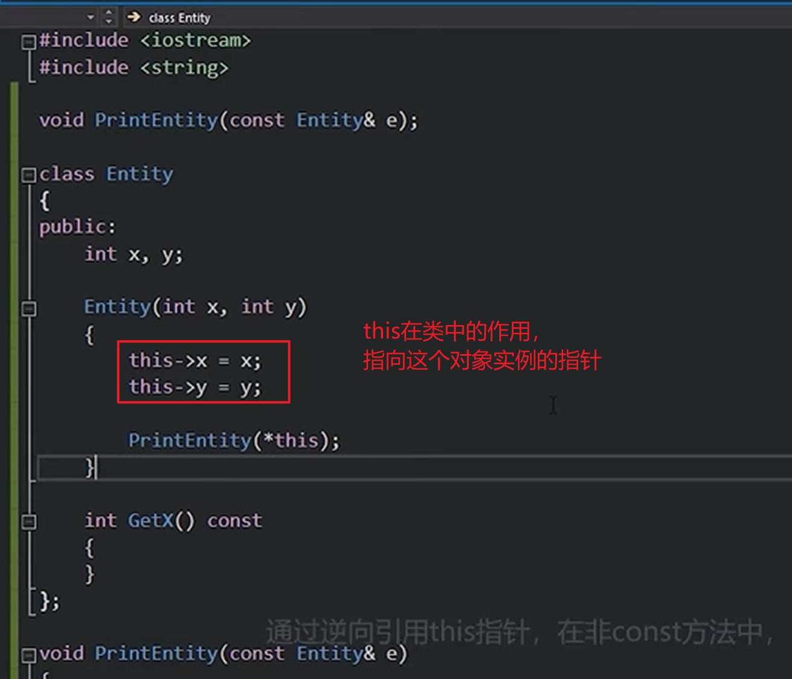

### 对象生存周期（栈作用域生存期）
- 作用域有哪些
- 生命周期是怎样的
- 生命周期结束后会发生什么
- 错误示例
  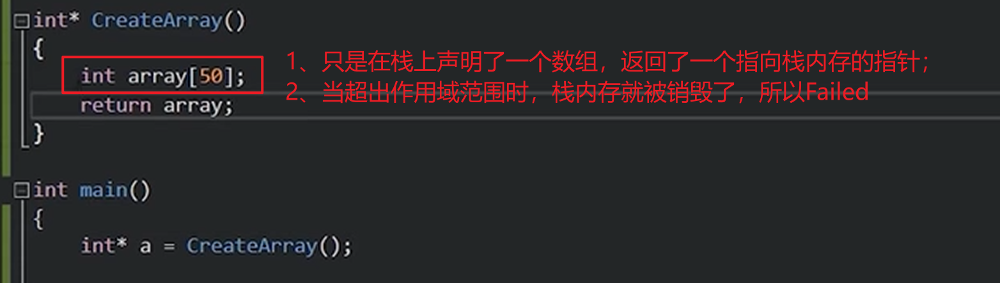
- 如何正确有效应用（作用域锁，使用栈对象自动管理堆内存周期）
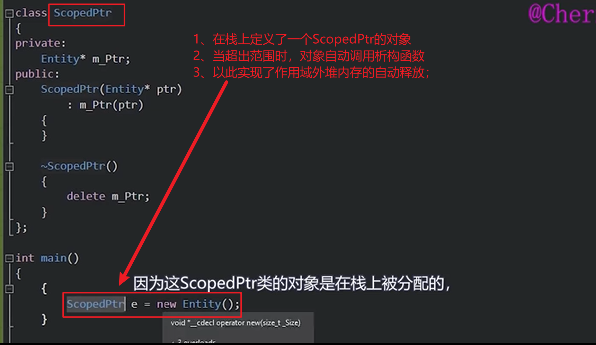
- 智能停止的定时器，当进入作用域时，定义定时器调用构造函数开始计时，退出作用域时，自动调用析构函数停止计时
- 互斥锁，当进入作用域时，定义互斥锁调用构造函数加锁，退出作用域时，自动调用析构函数解锁

### 智能指针
- 什么是智能指针
- 什么时候应该用智能指针，好处是什么
- 智能指针本质是指针的包装器，可以自动管理指针的生命周期
- unique_ptr，只能有一个指向同一个对象的指针，不能复制或赋值给其他指针
  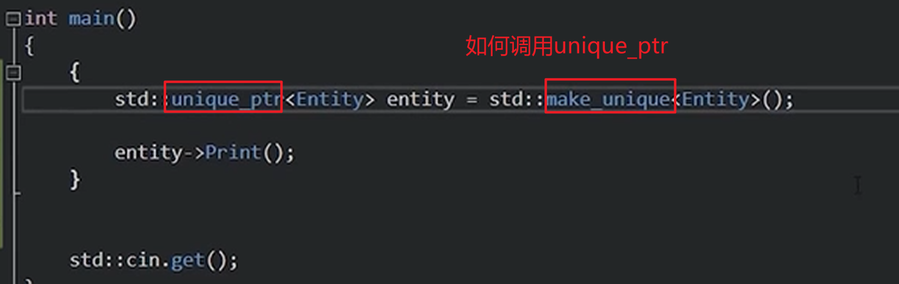
- shared_ptr,允许多个指针指向同一个对象，通过引用计数管理生命周期
- weak_ptr,弱引用，不增加对象的引用计数，只是提供对象的指针访问，常用于解决循环引用问题；
例如，如果两个对象互相持有 shared_ptr 指向对方，会导致引用计数永远不为零，从而造成内存泄漏。通过将其中一方改为 weak_ptr，可以打破这种循环引用关系，确保对象能够被正确释放。

### 复制与拷贝构造函数
- 友元函数
  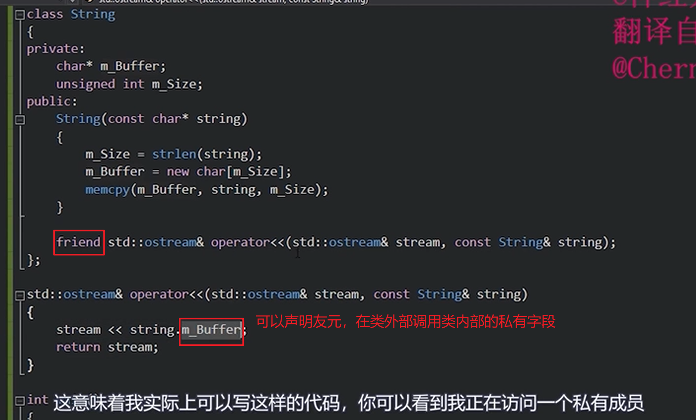
- 浅拷贝，是指只复制对象的指针，而没有复制对象本身的内容。这意味着原始对象和拷贝后的对象共享同一块内存区域，其中一个对象的修改会影响到另一个对象。这通常会导致问题，特别是在涉及到动态分配的内存时，因为两个对象可能会同时释放同一块内存，导致运行时错误。
- 深拷贝，是创建一个新的对象，并将原始对象的所有内容复制到新创建的对象中。这样，即使修改了拷贝后的对象的内容，也不会影响到原始对象。
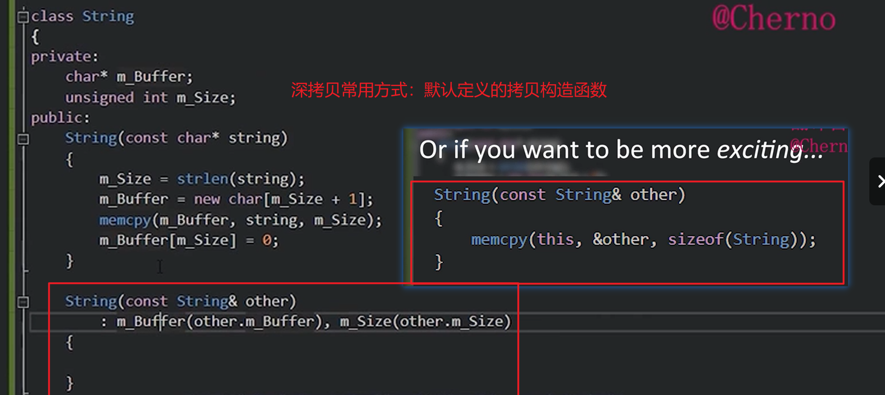
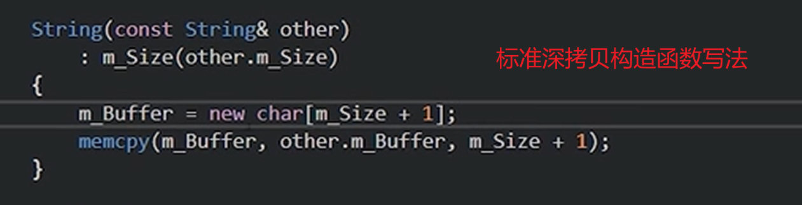
- 尽量通过const引用传递参数，避免不必要的拷贝

### 箭头操作运算符
- 箭头操作符（->）是C++中用于访问指向对象指针的成员的一种运算符。
- 它通常与智能指针一起使用，允许我们通过一个指向对象的指针来访问该对象的成员变量或调用其成员函数，
- 而无需显式地解引用指针。
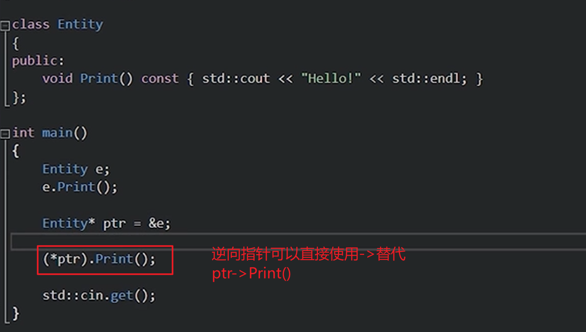

### 动态数组Vector
- 如何定义
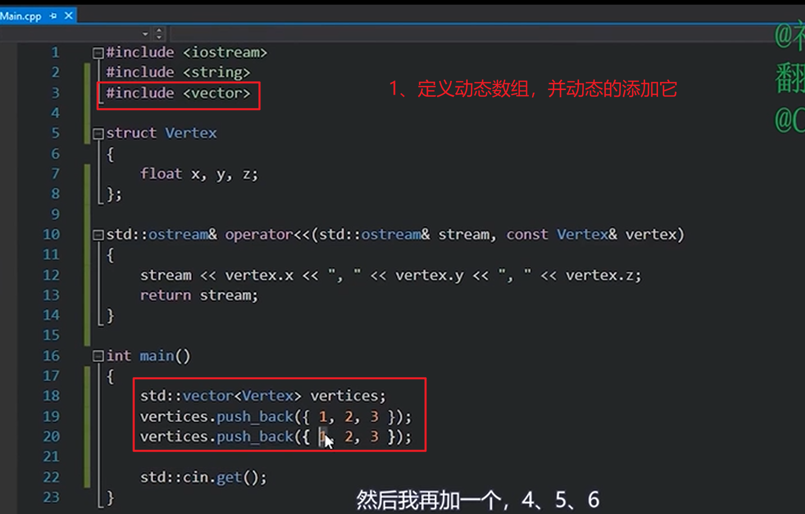
- 循环的两种写法（for与Foreach）
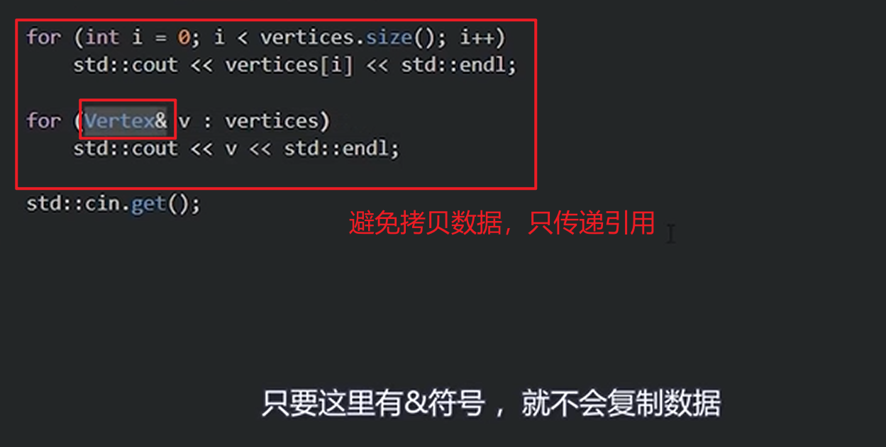
- 清除数组
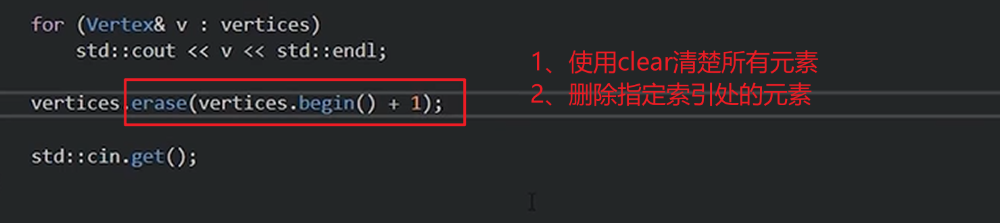
- 使用优化（了解动态扩容机制导致的内存拷贝问题）
  - 预定义需要使用的内存大小.reserve(Count)
  - 避免对象的拷贝，直接在预定义内存中构造对象.emplace_back()
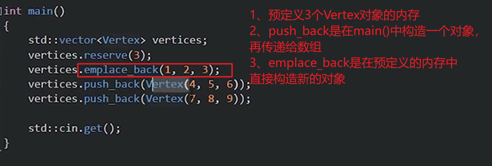

### 使用库（静态链接）
- 静态链接库（.lib或.a文件）：在编译时，编译器会将所需的函数代码直接包含到最终的可执行文件中。这意味着可执行文件包含了所有需要的代码和数据，因此体积较大，但运行时不需要额外的DLL文件。
- 如何拷贝静态链接文件
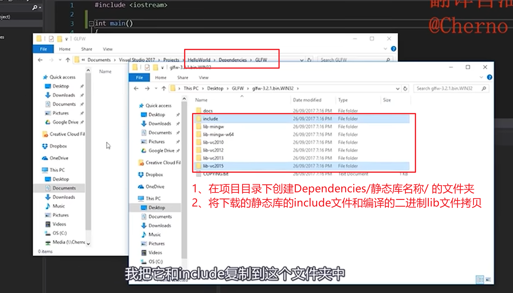
- 设置程序依赖库的相对路径
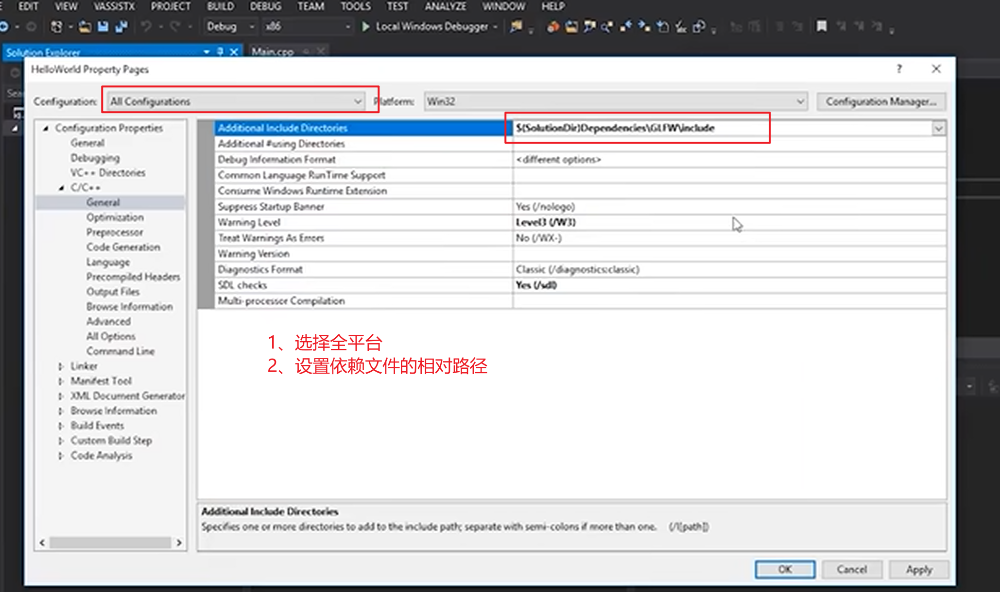
- 程序中include库的头文件
  - 如果使用“库文件.h”代表项目中可以找到源文件并编译；
  - 使用<库文件.h>代表是外部编译的库文件，需要编译器在include路径中查找。 
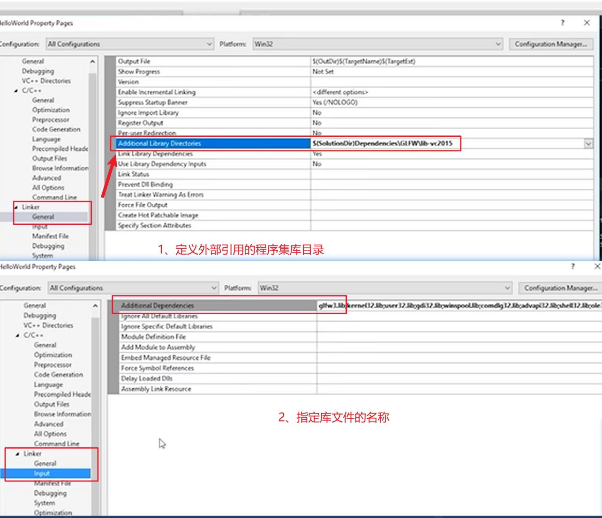

### 使用动态库
  - 动态链接库（.dll或.so文件）：在编译时，编译器会生成一个引用这些函数的代码的二进制模块。运行时，操作系统会在程序启动时加载所需的DLL文件到内存中，并解决所有外部函数调用的地址。这使得可执行文件体积较小，但需要运行时找到并加载相应的DLL文件。
  - 需要去除Linker/Input/Additional Dependencies中的静态库名称，在运行时动态加载
  - 如果将dll文件放在程序目录下，会默认加载

### 创建自定义库
- 设置项目为静态库
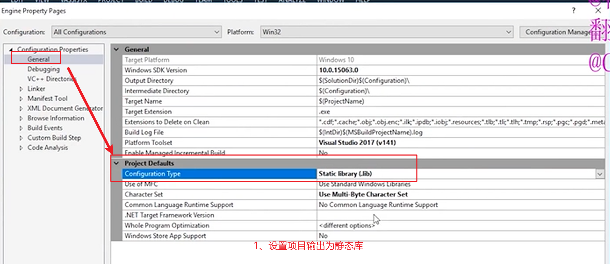

### 如何处理多返回值
- 使用结构体返回值
- 传参引用内部调用后返回
- 传参指针返回
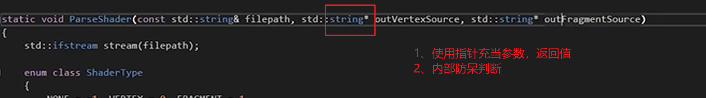
- 可以使用tuple或者pair返回多个值

### 模板Templates
- 如何创建
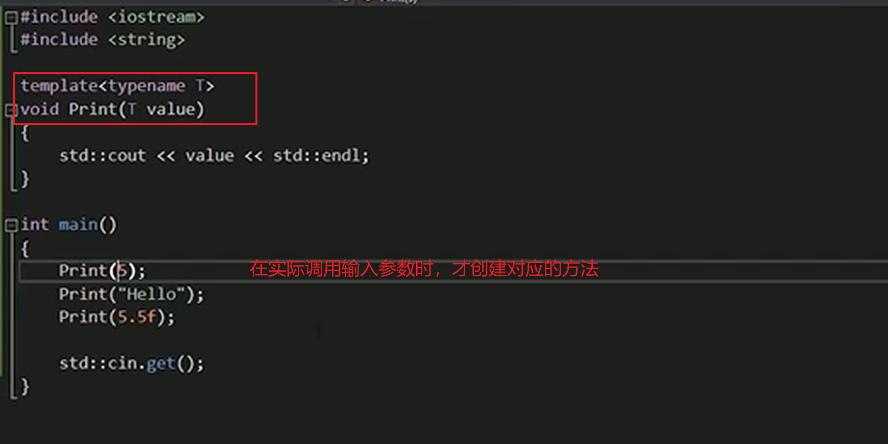
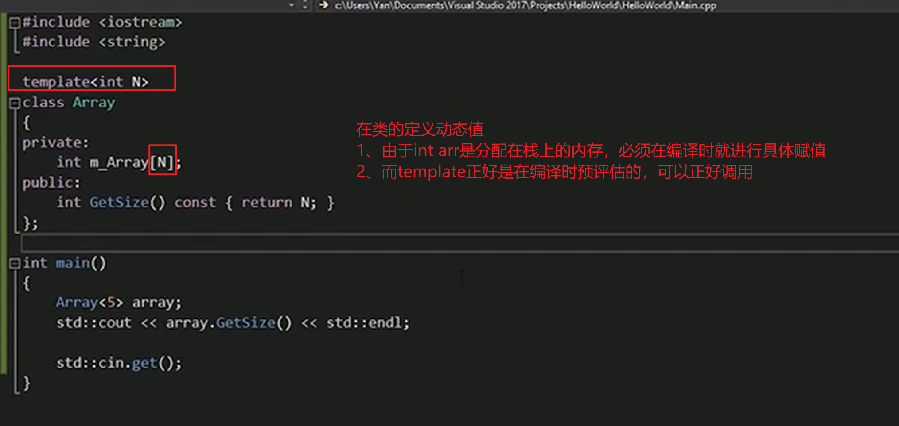
- 模板对于类的用法
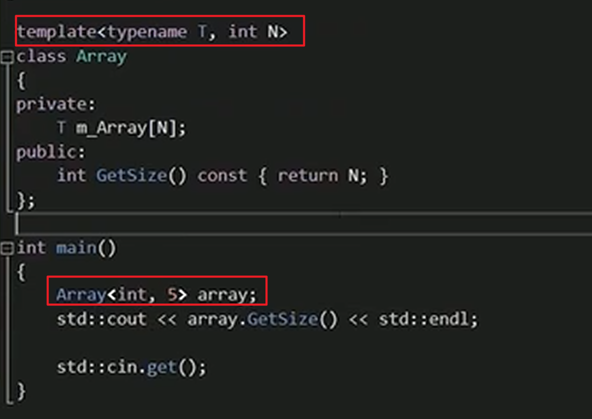

### 堆与栈内存的比较
- 栈内存：由编译器自动管理，分配速度快，但大小有限制，主要用于存储局部变量、函数调用栈等。
- 堆内存：需要程序员手动管理（使用new/delete或智能指针），分配速度较慢，但大小理论上没有限制，主要用于存储动态分配的对象。

### 宏
- 用在切换Debug和Release版本上
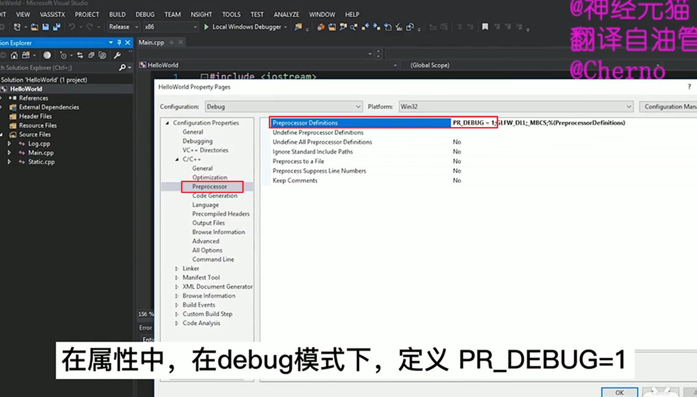
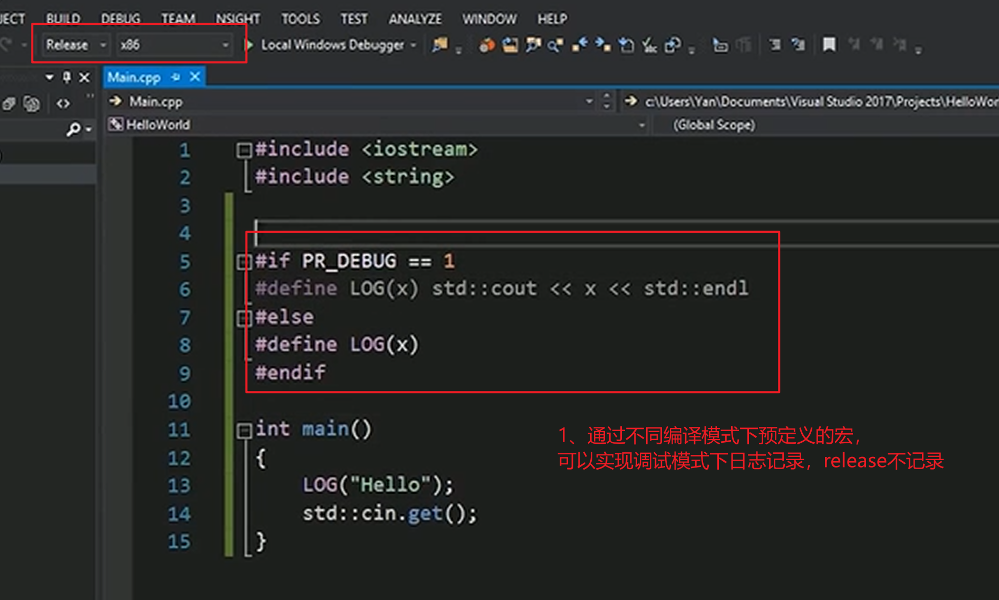
- 折叠屏蔽无效代码
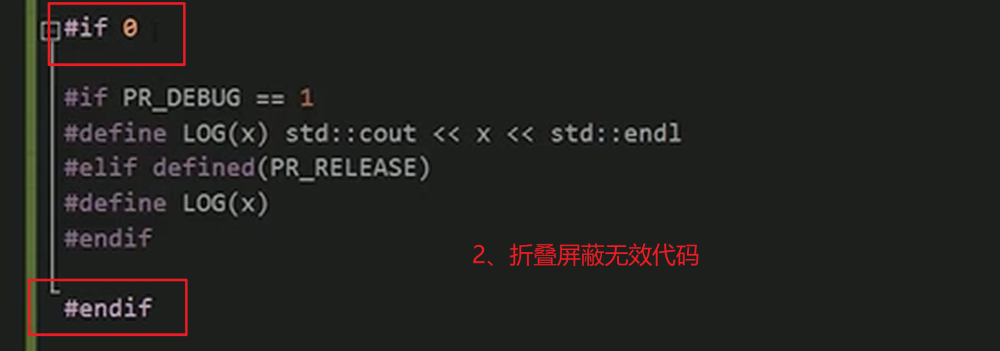
- 如何编写多行的宏
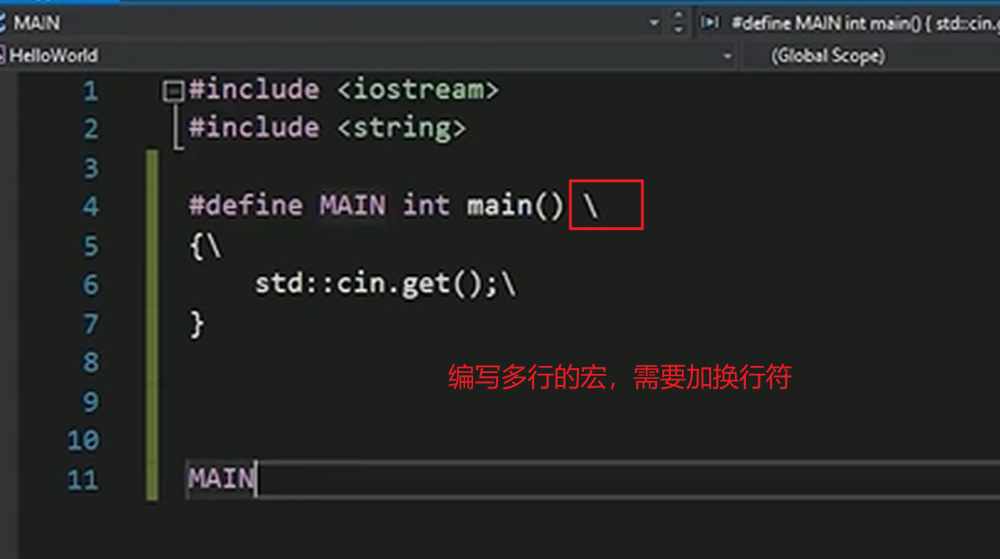

### auto关键字
- 对于自定义的复杂类型，可以考虑使用auto

