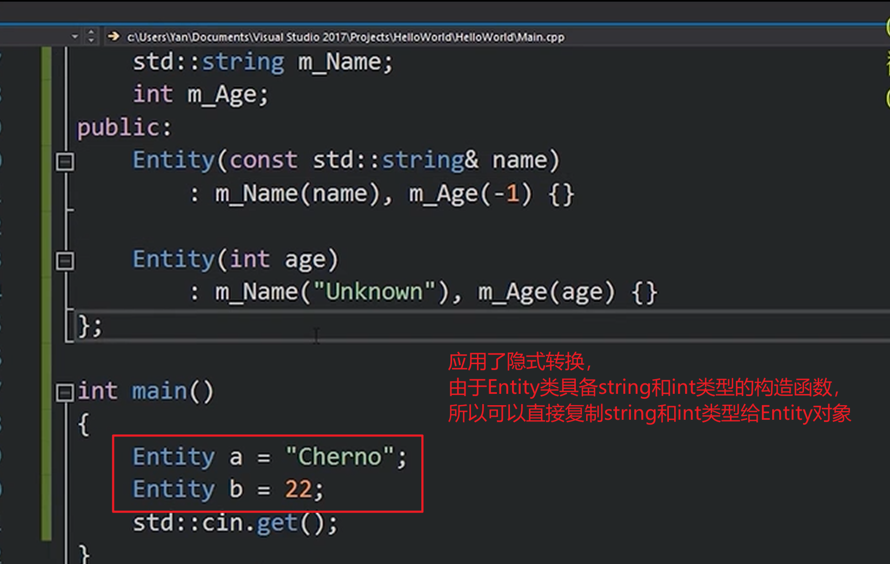

[TOC]
# C++

- 创建时间: 2025年05月20日 23:12

## 基础知识点
### 隐式转换与explict关键字
- **explict**放在构造函数前，阻止隐式转换，必须显式调用
- 隐式转换的例子

### 运算符及其重载
- 尽量不建议重载运算符，除非有特殊需求
- 重载 **+** 运算符

- 重载 **<<** 运算符

### this关键字
- 指向此对象实例的指针

### 对象生存周期（栈作用域生存期）
- 作用域有哪些
- 生命周期是怎样的
- 生命周期结束后会发生什么
- 错误示例
  
- 如何正确有效应用（作用域锁，使用栈对象自动管理堆内存周期）

- 智能停止的定时器，当进入作用域时，定义定时器调用构造函数开始计时，退出作用域时，自动调用析构函数停止计时
- 互斥锁，当进入作用域时，定义互斥锁调用构造函数加锁，退出作用域时，自动调用析构函数解锁

### 智能指针
- 什么是智能指针
- 什么时候应该用智能指针，好处是什么
- 智能指针本质是指针的包装器，可以自动管理指针的生命周期
- unique_ptr，只能有一个指向同一个对象的指针，不能复制或赋值给其他指针
  
- shared_ptr,允许多个指针指向同一个对象，通过引用计数管理生命周期
- weak_ptr, 解决shared_ptr循环引用问题