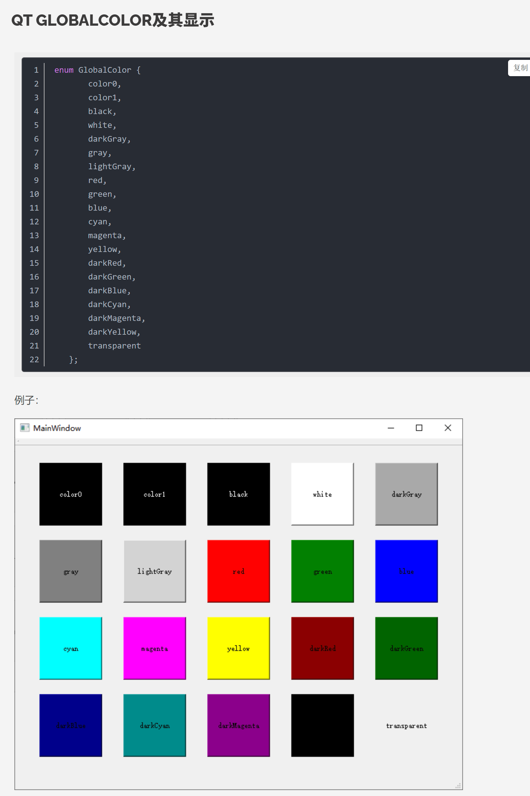

[TOC]
# Qt

- 创建时间: 2025年06月06日 22:02

## 视频教学
### 
### QColor与enum GlobalColor的使用
- 枚举颜色速览

- QColor的使用
1. 创建 QColor 对象
```cpp
#include <QColor>
// 使用RGB值
QColor color1(255, 0, 0); // 红色
// 使用十六进制字符串
QColor color2("#00FF00"); // 绿色
// 使用颜色名称
QColor color3("blue"); // 蓝色
// 使用静态方法
QColor color4 = QColor::fromRgb(128, 128, 128); // 灰色
```
2. 获取和设置颜色分量
```cpp
int red = color1.red();
int green = color1.green();
int blue = color1.blue();
color1.setRed(100);
color1.setGreen(150);
color1.setBlue(200);
```
3. 在控件中使用 QColor,设置控件的背景色：
```cpp
QPalette pal = widget->palette();
pal.setColor(QPalette::Background, QColor("#FFD700"));
widget->setAutoFillBackground(true);
widget->setPalette(pal);
```
4. 判断颜色是否有效
```cpp
QColor c("notacolor");
if (!c.isValid()) {
    // 颜色无效
}
```
5. 常用静态颜色
```cpp
#include <QColor>
QColor black = Qt::black;
QColor white = Qt::white;
QColor transparent = Qt::transparent;
```
### 优化const QString& 字符串的使用
- QStringLiteral() 宏可以优化 const QString& 的使用，减少不必要的拷贝和转换，会在编译时生成常量，效率更高；


### explict 与 emit 关键字
- explicit 关键字用于防止隐式类型转换，确保只能通过明确的构造函数调用进行对象创建。
  例如：
```cpp
class MyClass {
public:
    explicit MyClass(int value) : m_value(value) {}
private:
    int m_value;
};
// 这样会报错，因为使用了explicit阻止了隐式转换
MyClass obj = 10; // Error: no suitable conversion function from "int" to "MyClass"
// 需要这样显式地构造对象
MyClass obj2(10);
```
- emit 关键字用于发出信号（Signal），它是Qt的元对象系统的一部分，允许对象之间通信。使用emit关键字发出的信号可以被QObject派生类的槽函数接收和处理。
  例如：
```cpp
#include <QObject>
class SignalEmitter : public QObject {
    Q_OBJECT
signals:
    void mySignal(const QString &message);
public slots:
    void triggerSignal() {
        emit mySignal("Hello, world!");
    }
};
```
在上面的例子中，`mySignal`是一个信号，`triggerSignal()`槽函数通过emit关键字发出这个信号。其他QObject派生类的对象可以连接（connect）到这个信号并响应它。


## 问题收集
### qmake构建项目失败--202050616
- 使用qmake构建项目时，一直构建失败，原因时中文路径与“ ”的原因，记录如下，将`CMake完整版 V1.2`改为`CMakeV1.2`即可。


