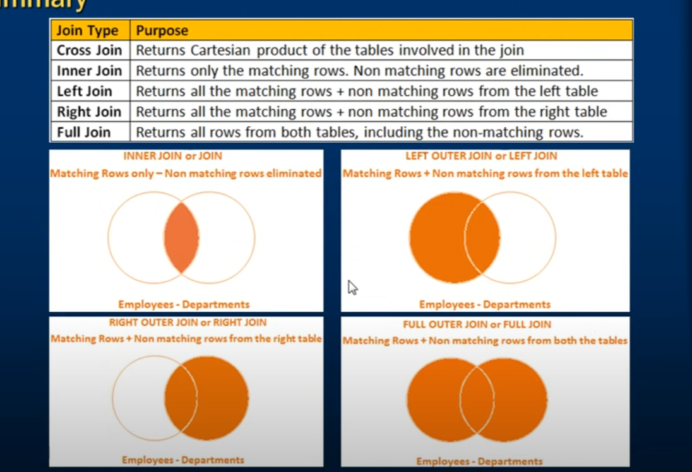
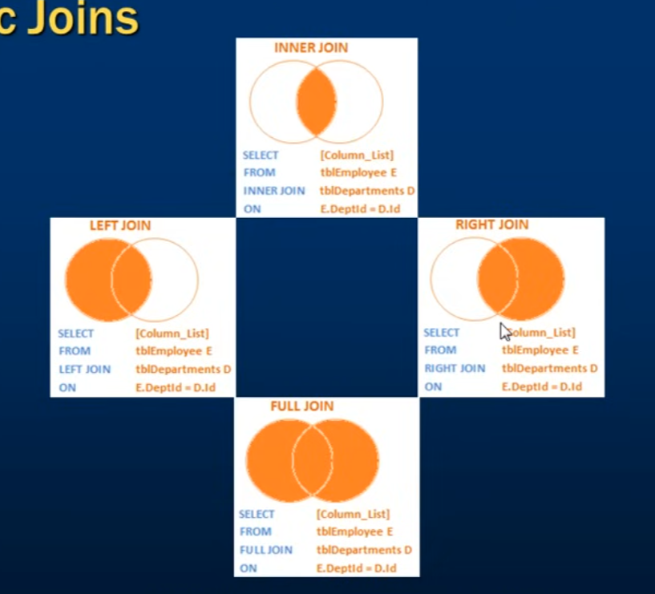
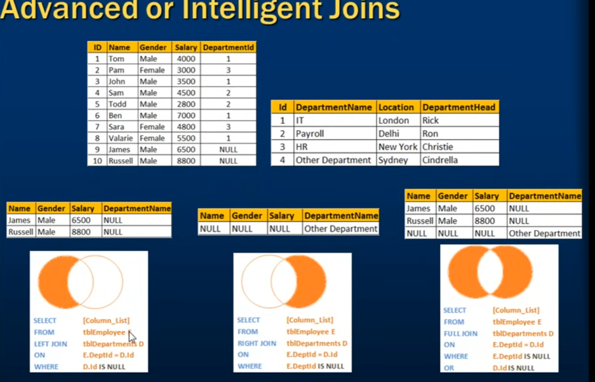
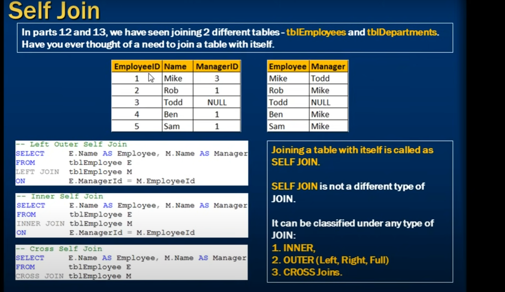
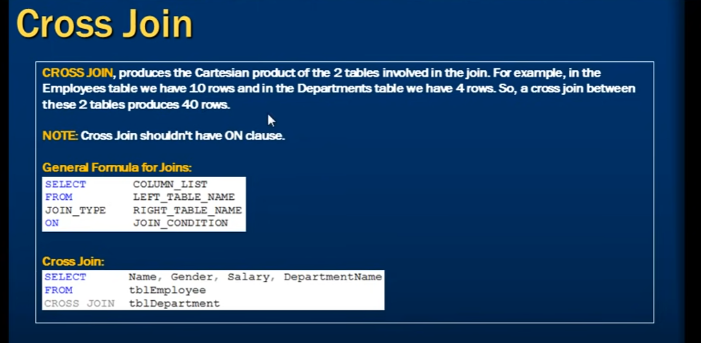
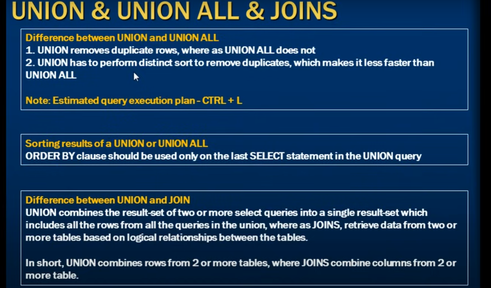

---

layout: default

---

>相关链接：[W3School-SQL](https://www.w3schools.com/sql/default.asp)

[TOC]
# SQL Tutotial
## SQL Syntax(Base)


### Table_Demo

| CustomerID | CustomerName                       | ContactName        | Address                       | City        | PostalCode | Country |
| ---------- | ---------------------------------- | ------------------ | ----------------------------- | ----------- | ---------- | ------- |
| 1          | Alfreds Futterkiste                | Maria Anders       | Obere Str. 57                 | Berlin      | 12209      | Germany |
| 2          | Ana Trujillo Emparedados y helados | Ana Trujillo       | Avda. de la Constitución 2222 | México D.F. | 05021      | Mexico  |
| 3          | Antonio Moreno Taquería            | Antonio Moreno     | Mataderos 2312                | México D.F. | 05023      | Mexico  |
| 4          | Around the Horn                    | Thomas Hardy       | 120 Hanover Sq.               | London      | WA1 1DP    | UK      |
| 5          | Berglunds snabbköp                 | Christina Berglund | Berguvsvägen 8                | Luleå       | S-958 22   | Sweden  |

### Select
>DISTINCT保留唯一项，COUNT求和
```SQL
SELECT * FROM Customers;
SELECT DISTINCT Country FROM Customers;
SELECT COUNT(DISTINCT Country) FROM Customers;
```
### Where
```SQL
SELECT * FROM Customers  WHERE Country='Mexico';
```

### Order BY
>查询结果排序，升序或降序，或者组合排
```SQL
SELECT * FROM Customers  
ORDER BY Country ASC, CustomerName DESC;
```

###  AND / OR
>查询结果筛选
```SQL
SELECT * FROM Customers  
WHERE Country = 'Spain' 
AND (CustomerName LIKE 'G%' OR CustomerName LIKE 'R%');
```
### NOT
>查询结果筛选，如 IN LIKE Between ...
```SQL
SELECT * FROM Customers WHERE NOT Country = 'Spain';
SELECT * FROM Customers WHERE CustomerName NOT LIKE 'A%';
SELECT * FROM Customers WHERE CustomerID NOT BETWEEN 10 AND 60;
SELECT * FROM Customers WHERE City NOT IN ('Paris', 'London');
SELECT * FROM Customers WHERE NOT CustomerID > 50;
SELECT * FROM Customers WHERE NOT CustomerId < 50;
```
### INSERT INTO
>Record插入，可指定FiledName，使用VALUES修饰插入值；
>可多行插入
```SQL
INSERT INTO 
Customers (CustomerName, ContactName, Address, City, PostalCode, Country)  
VALUES  
('Cardinal', 'Tom B. Erichsen', 'Skagen 21', 'Stavanger', '4006', 'Norway'),  
('Greasy Burger', 'Per Olsen', 'Gateveien 15', 'Sandnes', '4306', 'Norway');
```
### NULL
>NULL值判断，可搭配NOT使用
```SQL
SELECT CustomerName, ContactName, Address  
FROM Customers  
WHERE Address IS NOT NULL;
```
### UPDATE
>若省略*WHERE*则会导致所有Record都更新
```SQL
UPDATE Customers  
SET ContactName = 'Alfred Schmidt', City= 'Frankfurt'  
WHERE CustomerID = 1;
```
### DELETE
>若省略*WHERE*则会导致所有Record都更新
```SQL
DELETE FROM Customers;
DELETE FROM Customers WHERE CustomerName='Alfreds Futterkiste';
```
### TOP, LIMIT, FETCH FIRST or ROWNUM
>关于SQL SERVER的一些查询语句
```SQL
SELECT TOP 3 * FROM Customers;
SELECT TOP 50 PERCENT * FROM Customers;
SELECT * FROM Customers LIMIT 3;
SELECT TOP 3 * FROM Customers ORDER BY CustomerName DESC;
```

### LIKE
There are two wildcards often used in conjunction with the `LIKE` operator:
-  The percent sign `%` represents zero, one, or multiple characters
-  The underscore sign `_` represents one, single character
```SQL
1. Starts with 'L' followed by one wildcard character, then 'nd' and then two wildcard characters:
SELECT * FROM Customers WHERE city LIKE 'L_nd__';

2. Starts with 'La'
SELECT * FROM Customers WHERE CustomerName LIKE 'La%';

3. Starts with 'a' or starts with 'b':
SELECT * FROM Customers WHERE CustomerName LIKE 'a%';

4. Starts with "b" and ends with "s":
SELECT * FROM Customers WHERE CustomerName LIKE 'b%s';

5. Contains the phrase 'or'
SELECT * FROM Customers WHERE CustomerName LIKE '%or%';

6. Starts with "a" and are at least 3 characters in length:
SELECT * FROM Customers WHERE CustomerName LIKE 'a__%';
```

### IN
```SQL
1. Return all customers that have an order in the Orders table:
SELECT * FROM Customers WHERE CustomerID 
IN (SELECT CustomerID FROM Orders);

2. Return all that are NOT from 'Germany', 'France', or 'UK':
SELECT * FROM Customers WHERE Country 
NOT IN ('Germany', 'France', 'UK');
```

### BETWEEN
```SQL
SELECT * FROM Products WHERE Price BETWEEN 10 AND 20;
SELECT * FROM Products WHERE Price NOT BETWEEN 10 AND 20;

SELECT * FROM Orders WHERE OrderDate 
BETWEEN '1996-07-01' AND '1996-07-31'
GROUP BY OrderDate;
```
### AS
```SQL
SELECT CustomerName,Address + ',' +Country AS Address 
FROM Customers;

SELECT o.ID, o.OrderDate, c.Name  
FROM Customers AS c, Orders AS o
WHERE c.Name='A' AND o.ID='1';
```

## Wildcards
| Symbol | Description                                                  |
| ------ | ------------------------------------------------------------ |
| %      | Represents zero or more characters                           |
| _      | Represents a single character                                |
| []     | Represents any single character within the brackets *        |
| ^      | Represents any character not in the brackets *               |
| -      | Represents any single character within the specified range * |
| {}     | Represents any escaped character **                          |
```SQL
1. Return all customers starting with either "b", "s", or "p":
SELECT * FROM Customers WHERE CustomerName LIKE '[bsp]%';

2. Return all customers starting with "a", "b", "c", "d", "e" or "f":
SELECT * FROM Customers WHERE CustomerName LIKE '[a-f]%';
```

## SQL Syntax(High)
### JOIN
#### Different Types of SQL JOINs



#### SELF JOIN
```SQL
SELECT _column_name(s)_ FROM _table1 T1, table1 T2_  
WHERE _condition_;
```

#### CROSS JOIN

### UNION

The `UNION` operator is used to combine the result-set of two or more `SELECT` statements.
- Every `SELECT` statement within `UNION` must have the ==same number== of columns
- The columns must also have ==similar data types==
- The columns in every `SELECT` statement must also be in the ==same order==
>If some customers or suppliers have the same city, 
>each city will only be listed once, 
>because `UNION` selects only distinct values.
```SQL
SELECT City FROM Customers  
UNION  
SELECT City FROM Suppliers  
ORDER BY City;
```
> Use `UNION ALL` to also select duplicate values!
```SQL
SELECT City FROM Customers  
UNION ALL  
SELECT City FROM Suppliers  
ORDER BY City;
```
### GROUP BY
```SQL
SELECT COUNT(CustomerID), Country
FROM Customers
GROUP BY Country
ORDER BY COUNT(CustomerID) DESC;
```
### Having
>位于Group By之后，Where条件不能使用聚合函数，使用Having进行过滤
```SQL
SELECT COUNT(CustomerID), Country
FROM Customers
GROUP BY Country
HAVING COUNT(CustomerID) > 5
ORDER BY COUNT(CustomerID) DESC;
```
### EXISTS
>用于补充WHERE条件，用于判断子查询的结果是否满足条件，返回boolean值
```SQL
SELECT SupplierName
FROM Suppliers
WHERE EXISTS (
    SELECT ProductName 
    FROM Products 
    WHERE Products.SupplierID = Suppliers.supplierID 
    AND Price = 22);
```
### ANY / ALL
```SQL
// ANY 只要满足子查询条件中的任意一个，则返回true，否则返回false
SELECT ProductName FROM Products
WHERE ProductID = ANY
  (SELECT ProductID
  FROM OrderDetails
  WHERE Quantity > 99);
// ALL 必须满足子查询条件中的所有值，才返回true，否则返回false
SELECT ALL ProductName
FROM Products
WHERE TRUE;

// 直接创建一个新表架构，不复制数据
SELECT * INTO newtable
FROM oldtable
WHERE 1 = 0;
```
### SELECT INTO
```SQL
// 备份Customers表中德国的客户到Backup.mdb数据库中
SELECT * INTO CustomersGermany IN 'Backup.mdb'
FROM Customers
WHERE Country = 'Germany';
```
### Insert Into Select
```SQL
INSERT INTO Customers (CustomerName, City, Country)
SELECT SupplierName, City, Country FROM Suppliers
WHERE Country='Germany';
```
### CASE
```SQL
SELECT CustomerName, City, Country
FROM Customers
ORDER BY
(CASE
    WHEN City IS NULL THEN Country
    ELSE City
END);
```
### ISNULL
>`ISNULL()` is a built-in SQL function that returns the value of the first argument if it is not NULL, otherwise it returns the second argument.
```SQL
SELECT ProductName, UnitPrice * (UnitsInStock + ISNULL(UnitsOnOrder, 0))
FROM Products;

SELECT ProductName, UnitPrice * (UnitsInStock + COALESCE(UnitsOnOrder, 0))
FROM Products;
```

### Comments
>类似与注释，可以使用//或者/**/
```SQL
SELECT CustomerName, /*City,*/ Country FROM Customers;
```

## Operators


## Stored Procedures
>   A stored procedure is a prepared SQL code that you can save, so the code can be reused over and over again.
>   So if you have an SQL query that you write over and over again, save it as a stored procedure, and then just call it to execute it.
>   You can also pass parameters to a stored procedure, so that the stored procedure can act based on the parameter value(s) that is passed.
1. Stored Procedure with no parameters
2. Stored Procedure with one parameter
3. Stored Procedure with multiple parameters
```SQL
CREATE PROCEDURE SelectAllCustomers @City nvarchar(30), @PostalCode nvarchar(10)
AS
SELECT * FROM Customers WHERE City = @City AND PostalCode = @PostalCode
GO;

EXEC SelectAllCustomers @City = 'London', @PostalCode = 'WA1 1DP';
```


## Aggregate Functions
	An aggregate function is a function that performs a calculation on a set of values, and returns a single value.
	Aggregate functions are often used with the `GROUP BY` clause of the `SELECT` statement. 
	The `GROUP BY` clause splits the result-set into groups of values and the aggregate function can be used to return a single value for each group.
The most commonly used SQL aggregate functions are:
- `MIN()` - returns the smallest value within the selected column
- `MAX()` - returns the largest value within the selected column
- `COUNT()` - returns the number of rows in a set
- `SUM()` - returns the total sum of a numerical column
- `AVG()` - returns the average value of a numerical column
==Aggregate functions ignore null values== (except for `COUNT()`).

### MIN(),MAX()
>AS可以搭配`WHERE`等条件，赋予返回值别名
```SQL
SELECT MAX(Price) FROM Products;
SELECT MIN(Price) AS SmallestPrice FROM Products;

SELECT MIN(Price) AS SmallestPrice, CategoryID 
FROM Products GROUP BY CategoryID;
```
### COUNT()
```SQL
查找包含NULL值的个数(*)
SELECT COUNT(*) FROM Products;

查找ProductName不为NULL的个数(ColumnName)
SELECT COUNT(ProductName) FROM Products;

条件筛选
SELECT COUNT(ProductID) FROM Products WHERE Price > 20;
SELECT COUNT(DISTINCT Price) FROM Products;

别名AS[]
SELECT COUNT(*) AS [Number of records] FROM Products;

SELECT COUNT(*) AS [Number of records], CategoryID  
FROM Products  
GROUP BY CategoryID;
```
### SUM()
```SQL
SELECT SUM(Quantity) AS total FROM OrderDetails WHERE ProductId = 11;
SELECT SUM(Quantity * 10) FROM OrderDetails;
```
### AVG()
```SQL
SELECT * FROM Products  
WHERE price > (SELECT AVG(price) FROM Products);
```
