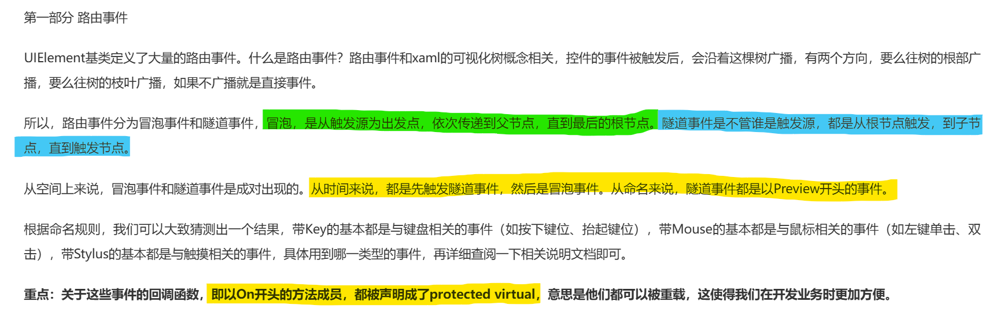
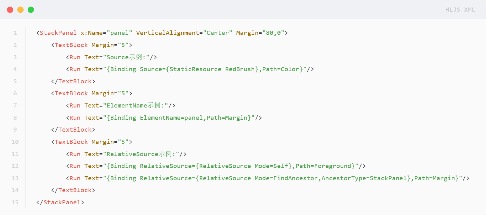
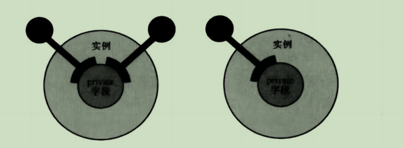

[TOC]
#  📌WPF Tutorial
- 创建时间: 2024年12月29日 21:01
- Tag: Website
- [WPF中文网](https://www.wpfsoft.com/)
- [深入浅出WPF](https://www.kdocs.cn/l/ckH3CD1T3Ugn)
- [pub_sams-teach-yourself-wpf-in-24-hours](https://www.kdocs.cn/l/cdAHEuHmTVJW)


## WPF下的MVVM模式

## XAML
1. Extensible Application Markup Language (XAML) 扩展应用程序标记语言;
2. XAML 是 WPF 技术中专门用于设计 UI 的语言； 
3. 实现 ``高内聚UI-低耦合逻辑`` ；

## 控件和布局
### 控件父类

- ``DispatcherObject类``
DispatcherObject是后台线程和前台线程的架海紫金梁，虽然所有的控件都必须在前台UI线程中创建，但是在开发过程中，难免需要在后台线程中去操作控件，于是Dispatcher调度员提供了Invoke和BeginInvoke两个方法，供我们可以安全的访问UI线程中的控件。
  
- DependencyObject类
  
- Visual类
  Visual类是WPF框架中第三个父类，主要是为 WPF 中的呈现提供支持，其中包括命中测试、坐标转换和边界框计算。
  它位于程序集:PresentationCore.dll库文件中，它的命名空间是System.Windows.Media。
  
  
- UIElement类 
  UIElement类继承了Visual类，在WPF框架中排行老四（第4个基类）。它位于程序集:PresentationCore.dll之中，命名空间:System.Windows。
  - 路由事件 Routed Events
    
  - 依赖属性 Dependency Properties
    
    
- FrameworkElement类
    

### 控件的内容模型

## Elements Tree
1. 控件的层级结构有两种：逻辑树结构和可视化树结构。
2. 两个树实际上只是构成 UI 的同一组对象的两个不同视图。
### Logical Tree Structure  逻辑树结构
1. Dependency properties 依赖属性；
2. Static and dynamic resources 静态和动态资源；
3. Binding object 对象绑定；
### Visual Tree Structure  可视化树结构
1. 呈现视觉对象，渲染布局；
2. 路由事件主要沿可视化树（而不是逻辑树）传输；

## 数据绑定 Binding
1. 一般情况下，应用程序具备三层结构，分别为
- `数据存储层`，使用数据库和文件系统；
- `数据处理层`，使用ADO.NET等技术；
- `数据展示层`，使用WPF类库；
2. Binding是桥梁，数据从哪里来就是Source，数据到哪里去就是Target；
3. Binding的模型；
   
### 如何使用Binding
1. 如何将数据暴露给UI并通知UI更新呢?
   - 首先数据源的类要实现`INotifyPropertyChanged`接口；
   
   
   - 在XAML中，通过``{Binding Path=属性名}``的方式绑定；
   - 在XAML.CS中，通过代码的方式绑定；
      
   ```CSharp
   //简化写法
   this.textName.SetBinding(TextBox.TextProperty, new Binding("Name"))
   {
      Source = this.data, 
      Mode = BindingMode.TwoWay, 
      UpdateSourceTrigger = UpdateSourceTrigger.PropertyChanged
   };
   ```
2. 使用Prism库中的`BindableBase类`简化数据绑定；


### Binding的源
1. 源是一个对象，并且通过属性公开数据，即实现`INotifyPropertyChanged`接口的对象；
2. 源一般是数据源对象，但控件也可以充当源，只需要`ElementName`指向控件的名称即可；

3. 如何指定源？


4. 使用xml数据作为源时，使用XPath属性；
5. 当UI需要的属性没有被暴露出来，可以使用`ObjectDataProvider`作为数据源;
6. **RelativeSource属性可以指定相对于当前控件的源对象**；


### Binding的Path

### DataContext
>DataContext作为一个依赖属性，可以沿着UI树从根向上传递，并被所有子控件继承；

### Binding的四种模式
- BindingMode.OneWay单向绑定；
- BindingMode.TwoWay双向绑定；
- BindingMode.OneWayToSource单向到源；
- BindingMode.OneTime一次绑定；

### Bindingd的四种触发方式
- UpdateSourceTrigger.Default默认触发；
- UpdateSourceTrigger.PropertyChanged属性值改变时触发;
- UpdateSourceTrigger.Explicit显式触发;
- UpdateSourceTrigger.LostFocus失去焦点时触发;


### 数据验证 Validation
1. 创建ValidationRule抽象类的派生类，实现Validate方法；
若校验通过，则返回ValidationResult.ValidResult;
否则将ValidationResult.IsValid=false，并设置ErrorContent属性为错误信息；


2. 什么时候确定校验
Binding只有在Target 被外部方法更新时校验数据，例如TextBox控件的Text属性绑定时，只有在用户输入完成后失去焦点时才会校验数据，这是为了校验来自Target的数据；
若想要校验来自Source的数据，则需要将校验条件的`ValidatesOnTargetUpdatad=True`;


3. 校验失败的异常捕获


### 绑定转换器 IValueConverter
1. 绑定转换器可以将绑定的数据转换成另一种格式，例如将字符串转换为枚举类型；
2. 实现`IValueConverter`接口的类必须包含两个方法：`Convert`（Source to Target）和`ConvertBack`(Target to Source)；
3. 在XAML中使用Binding.Converter属性指定绑定转换器的实例；
4. 使用代码方式绑定时，通过Converter属性设置绑定转换器；
5. 示例代码如下所示：
```csharp
 public class GenderEnumToListConverter : IValueConverter
 {
     public object Convert(object value, Type targetType, object parameter, CultureInfo culture)
     {
         // 忽略传入的值，直接返回枚举值的列表
         return Enum.GetValues(typeof(GenderEnum));
     }

     public object ConvertBack(object value, Type targetType, object parameter, CultureInfo culture)
     {
         // 尝试将选中的值转换回GenderEnum枚举值
         if (value is string enumString)
         {
             if (Enum.TryParse<GenderEnum>(enumString, out var enumValue))
             {
                 return enumValue;
             }
         }
         // 如果转换失败，返回枚举的默认值
         return GenderEnum.Unknown;
     }
 }
```

### MultiBinding 多路绑定
1. 多路绑定可以将多个数据源合并为一个值；
2. 使用`MultiBinding`元素，并通过`Bindings`子元素指定每个绑定的详细信息；
3. 例如验证多次输入的密码是否一致；
   


## 依赖属性 Dependency Property

### CLR属性
首先介绍``CLR属性``；
1. C#语言规定：对类有意义的字段和方法使用Static关键字修饰，通过类名+访问操作符可以访问；对类的实例有意义的字段和方法使用Non-Static关键字修饰，通过实例对象+访问操作符可以访问；
2. 此时字段只分为private和public两类，没有封装的概念；这种将字段暴露给外部的做法，违背了封装原则，每次写入都需要在外部判断字段的合理性；

3. 然后增加了一对非private的Get/Set方法，封装了字段的访问；但是每个字段都需要写一对方法，代码比较分散；

4. 最后 .Net Framework推出时，微软将Get/Set方法合并为属性``Property``;

### 依赖属性可以节省内存开销；
   
   
### 声明和使用依赖属性
1. 依赖属性是由 public static readonly DependencyProperty 定义的实例字段；
2. 依赖属性的包装器（Wrapper）是一个CLR属性，作用是以``实例属性``的形式向外界暴露依赖属性，这样依赖属性才能成为数据源的一个Path；


### 依赖属性值如何存取
1. 调用依赖对象的``SetValue``方法时，值被存储到哪里？
因为依赖对象的依赖属性是 public static readonly 修饰的，所以值不可能保存到实例对象中，不然几百个实例都赋值时就乱了；
2. 从源码发现，DependencyProperty.Register 实际上是对 DependencyProperty.RegisterCommon方法的调用；

3. 为什么使用 Static 和 Readonly 修饰依赖属性？
   
4. GetValue的数据来源；
   
5. SetValue方法的流程；
   
6. Propdp的设计理念
   
### 附加属性 Attached Property
1. 附加属性的含义
   附加属性是WPF中的一个特性，它允许你将一个属性附加到任何元素上，而不仅仅是该元素的类型定义的属性。这使得可以在不修改原始类的情况下扩展其功能；
2. 如何声明
   
3. 如何使用
   


## 事件
1. `CLR直接事件模型`中，事件的拥有者就是消息的发送者（sender）;
   
### WPF内置路由事件

1. 添加侦听器；
所有`UIElement`都具备`AddHandler`方法;
2. 查看事件的源头；
```csharp
private void Button_Click(object sender, RoutedEventArgs e)
{
   MessageBox.Show((e.OriginalSource as FrameworkElement).Name);
}

```   
### 自定义路由事件
1. 标准实现；
   
2. 如何注册路由事件;
   
3. 阻止路由事件的进一步传播；
   e.Handled = true;

### RoutedEventArgs 的 Source 和 OriginalSource
1. RoutedEventArgs具备两个属性：Source和OriginalSource;
2. Source 表示 LogicTree 中的事件源;
3. OrignalSource 表示 VisualTree 中的事件源;

### 附加事件
1. 路由事件的宿主都是拥有可视化实体的界面元素，附加事件则可以附加到任何对象上；
2. 由于只有UIElement才拥有添加路由事件、删除路由事件、触发路由事件的能力，所以附加事件的宿主只能是UIElement的派生类；


## 命令 Command
1. 命令相对于事件，具备约束性和顺序执行性；
2. CommandBinding一定要设置在命令目标的外围控件上，不然无法捕捉到吧CanExecute和Execute事件；
3. RoutedCommand与业务逻辑无关，业务逻辑要依靠外围的CommandBinding实现；
### 构成元素

### ICommand接口

### 预定义命令于命令参数


## 资源
1. WPF的每个界面元素都具备一个Resource属性；
2. 在检索资源时，首先查找控件自己的Reousrce,然后沿着逻辑树向上查找；
   若最顶层的容器都找不到，则查找Application Resources;
   否则，抛出异常；
### 静态资源与动态资源
1. 静态资源在编译时就已经确定，不会随数据变化而改变；
2. 动态资源在运行时绑定到数据源上，会随着数据的改变而改变；
3. 如何区分？
   - 静态资源使用``{StaticResource}``标记扩展语法;
   - 动态资源使用``{DynamicResource}``标记扩展语法;
4. 资源字典中的资源成为WPF，程序的内嵌资源称为程序集资源；
5. 程序的内嵌资源文件Resouces.resx，必须修改访问级别为Public;
   好处是便于程序的国际化，修改界面语言只需要重新写一个Resouces.resx文件即可；
   
6. 使用Pack URI标记扩展语法访问程序集资源；
   
7. 几种资源的定义方式；
   
   1. 直接在XAML中定义；
   2. 定义在资源字典中；
   3. 定义在单独文件中；

## 模板
1. 控件的“算法内容”：指控件能展现那些数据，具有哪些方法，能响应那些操作；
2. 控件的“数据内容”：指控件所展示的具体数据是什么；

### DataTemplate 与 ControlTemplate


### Style
1. Setter
   
### Trigger
1. 基本Trigger；
   
2. MultiTrigger
   
3. DataTrigger
   
4. MultiDataTrigger
   
5. EventTrigger
   

## 绘图和动画
### 路径


### 动画


## 多线程

### Dispather
1. Dispatcher是WPF的线程调度器，负责将UI操作放到主线程中执行；

2. Dispather.BeginInvoke

3. 使用Invoke和BeginInvoke的重点


### BackgroundWorker
1. 在xaml中定义BackgroundWorker;

2. 关联响应事件/在代码中提取BackgroundWorker实例；

3. BackgroundWorker.`RunWorkerAsync`(输入)；

4. BackgroundWorker_DoWork(object sender, DoWorkEventArgs e);
`DoWorkEventArgs.Argument与Result`

5. `RunWorkerCompleted`(object sender, RunWorkerCompletedEventArgs e);

6. 跟踪进度

7. 取消任务


