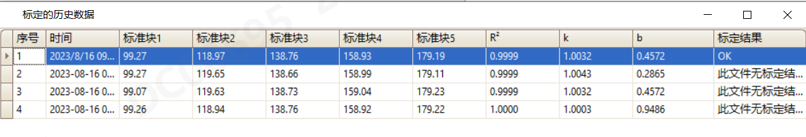
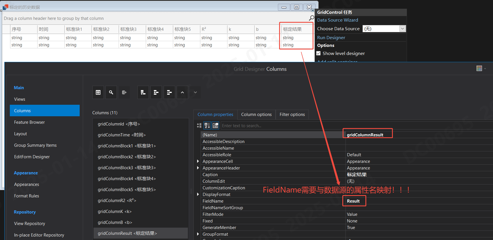
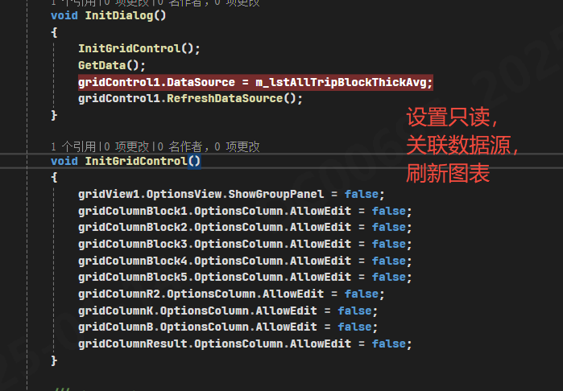

## 界面效果展示


## 数据源设计
```Csharp
public class AllTripBlockThickAvg
{
    //ID
    public string Id { get; set; }

    //Time
    public string Time { get; set; }

    //Block1
    public string Block1 { get; set; }

    //Block2
    public string Block2 { get; set; }

    //Block3
    public string Block3 { get; set; }

    //Block4
    public string Block4 { get; set; }

    //Block5
    public string Block5 { get; set; }

    //R²
    public string ValueR2 { get; set; }

    //k值
    public string ValueK { get; set; }

    //b值
    public string ValueB { get; set; }

    /// <summary>
    /// 标定结果
    /// </summary>
    public string Result { get; set; }
}
```

## UI设计及刷新

