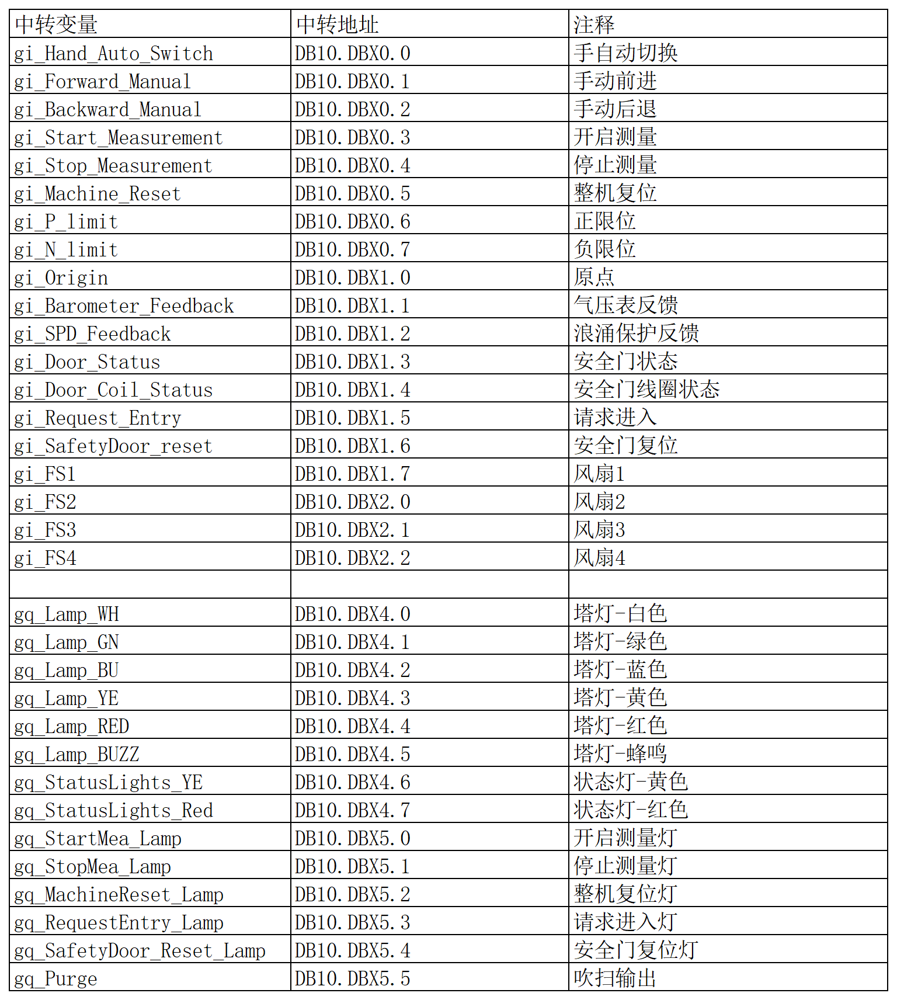
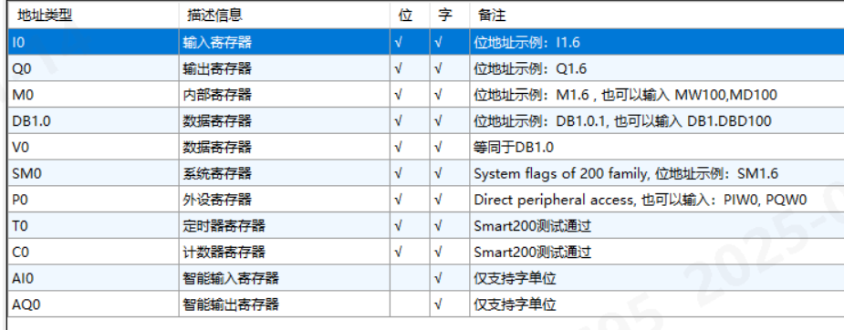
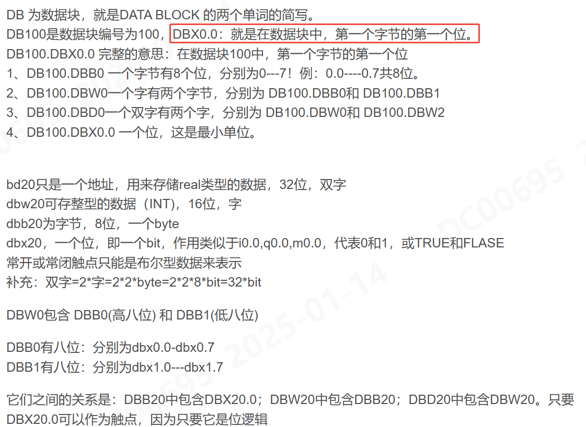
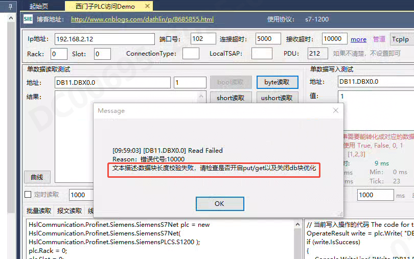
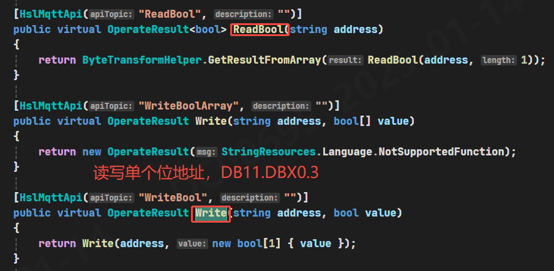
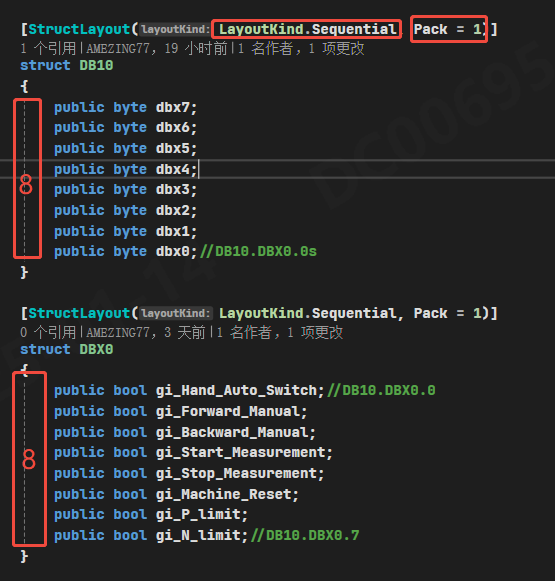
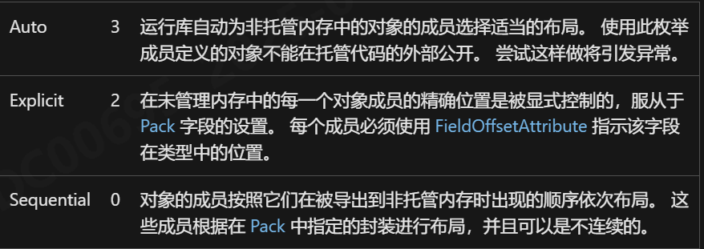
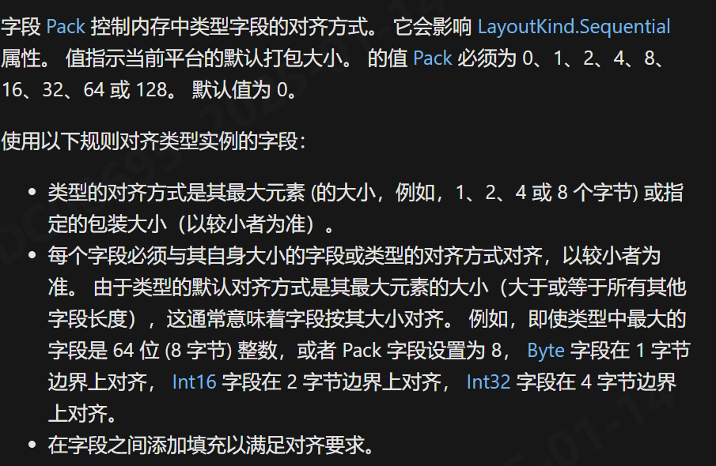
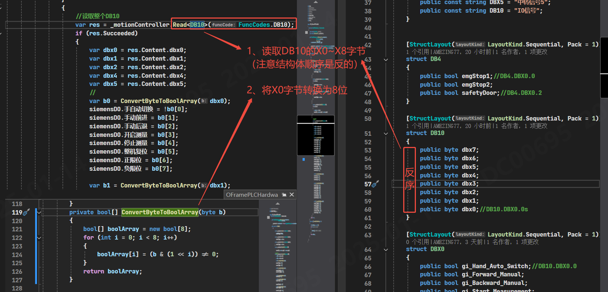

## 概述
基于HslCommunication.dll进行西门子S71200的通讯开发，涉及到DB块的读写操作；

## 开发环境
1. VS2022
2. .NET Framework 4.7.0
3. WPF
4. HslCommunication.dll 12.0.2
   
## 开发内容
### 涉及点位



### 西门子地址的详解



### 通讯协议
```Csharp
HslCommunication.Profinet.Siemens.SiemensS7Net plc = new HslCommunication.Profinet.Siemens.SiemensS7Net( HslCommunication.Profinet.Siemens.SiemensPLCS.S1200 );
plc.Rack = 0;
plc.Slot = 0;
plc.CommunicationPipe = new HslCommunication.Core.Pipe.PipeTcpNet("127.0.0.1", 102)
{
    ConnectTimeOut = 5000,    // 连接超时时间，单位毫秒
    ReceiveTimeOut = 10000,    // 接收设备数据反馈的超时时间
    SleepTime = 0,
    SocketKeepAliveTime = -1,
    IsPersistentConnection = true,
};
```

## 读写DB块
### PLC设置
- 关闭PLC的CPU保护；
- 设置的DB块取消DB优化；
- DB块设置Put/Get

### 字节序
**C# 在 windows 平台上默认是小端序，西门子是大端序；** 
所以在读西门子DB块时，需要注意字节序的转换；
```Csharp
private static void ReverseBytes(byte[] bytes)
{
    if (bytes == null) { throw new ArgumentNullException(nameof(bytes)); }
    if (BitConverter.IsLittleEndian) Array.Reverse(bytes);
}
```
### 读取连续点位时的数据结构映射Byte[]
1. 读取**单个点位**时，直接使用HslCommunication.dll的读写方法；
   
2. 读取**连续点位**时，需要将数据结构映射到Byte[]中，再进行字节序转换后，再进行后续操作。
3. 注意数据类型要和西门子DB块中的数据类型一致；
   例如读写DB11时，读取单字节对应 DB11.DBX0.0~DB11.DBX0.7；
   读取8字节对应 DB11.DBX0~DB11.DBX7,
   `每个字节对应X0~X7的8个位`；
### C#中数据结构体设计
   - 常见的数据类型，float与bool,都是四个字节；
   - 使用 `Marshal.SizeOf(typeof(T))` 方法来获取各种数据类型的字节大小;
   - 常见的数据类型大小如下表所示：
  
    | Data Type | Size (bytes) |
    |-----------|--------------|
    | byte      | 1            |
    | short     | 2            |
    | int       | 4            |
    | long      | 8            |
    | float     | 4            |
    | double    | 8            |
    | char      | 2            |
    | bool      | 1            |
    | decimal   | 16           |
4. 代码实例；

- LayoutKind

- Pack


### 数据结构体与Byte[]的转换
```CSharp
 private static byte[] StructToBytes<T>(T structObj, out int size)
 {
     size = Marshal.SizeOf(structObj);
     byte[] bytes = new byte[size];
     GCHandle pinnedArray = GCHandle.Alloc(bytes, GCHandleType.Pinned);
     try
     {
         IntPtr pointer = pinnedArray.AddrOfPinnedObject();
         //将结构体拷到分配好的内存空间
         Marshal.StructureToPtr(structObj, pointer, false);
     }
     finally { pinnedArray.Free(); }
     return bytes;
 }

 private static T BytesToStuct<T>(byte[] bytes) where T : struct
 {
     int size = Marshal.SizeOf(typeof(T));
     //byte数组长度小于结构体的大小
     if (size > bytes.Length)
     {
         throw new ArgumentException($"输入的Buffer长度{bytes.Length}小于结构体{typeof(T).Name}的大小");
     }
     GCHandle pinnedArray = GCHandle.Alloc(bytes, GCHandleType.Pinned);
     try
     {
         IntPtr pointer = pinnedArray.AddrOfPinnedObject();
         //将内存空间转换为目标结构体
         return Marshal.PtrToStructure<T>(pointer);
     }
     finally { pinnedArray.Free(); }
 }
```

### 单Byte转换8位读取为Bool[]
