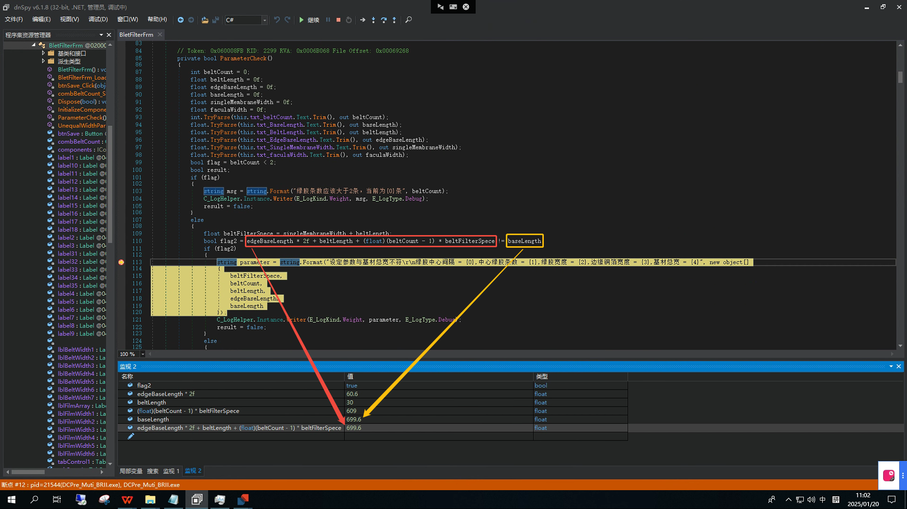
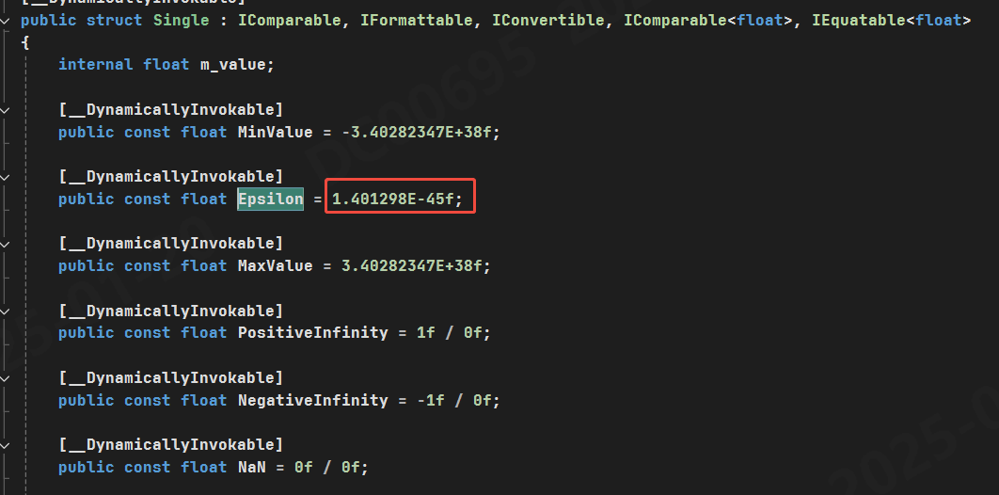

## 描述
>浮点数相等判断，调试时遇到的BUG；


## 原因
>浮点数在计算机中是以二进制的形式存储的，但是由于精度问题，两个看似相等的浮点数实际上可能并不完全相等。


## 解决办法
1. 使用`Math.Abs(a - b) < float.Epsilon`来判断是否相等，其中epsilon是一个很小的正数，用来表示允许的最大误差范围。例如：
```csharp
float a = 0.1f;!
float b = 0.3f - 0.2f;
if (Math.abs(a - b) <= float.Epsilon) 
```
2. 使用`Math.Round`类进行精度截断，这种方法适用于需要特点业务场景。例如：
