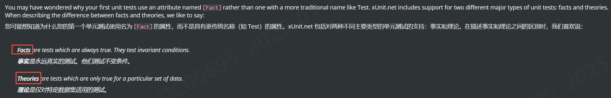
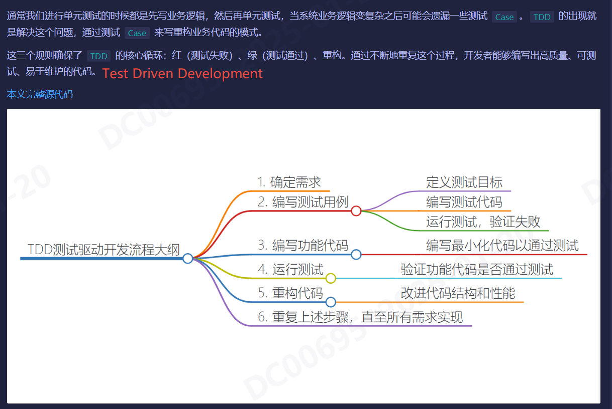

## 单元测试之 xUnit
- https://xunit.net/
- https://www.cnblogs.com/ruipeng/p/18112221

### 测试框架
```Csharp
  <ItemGroup>
    <PackageReference Include="coverlet.collector" Version="6.0.0" />
    <PackageReference Include="Microsoft.NET.Test.Sdk" Version="17.8.0" />
    <PackageReference Include="xunit" Version="2.5.3" />
    <PackageReference Include="xunit.runner.visualstudio" Version="2.5.3" />
  </ItemGroup>
```
### 测试理论
在单元测试中通常要遵循AAA模式，也就是Arrange、Act、Assert，这是一种常见的测试组织结构。
- Arrange（准备）: 在这个阶段，将设置测试的前提条件，初始化对象、设置输入参数等。简单讲就是准备测试环境，确保被测代码在正确的上下文中执行。
- Act（执行）: 在这个阶段，会执行要测试的代码或方法。这是针对被测代码的实际调用或操作。
- Assert（断言）: 在这个阶段，会验证被测代码的行为是否符合预期。检查实际结果与期望结果是否一致，如果不一致则测试失败。

### 特性
- Fact
- Threoy
- InlineData
- MemberData
- 自定义DataAttribute

### 调试
- ITestOutputHelper 控制台输出
### TDD
