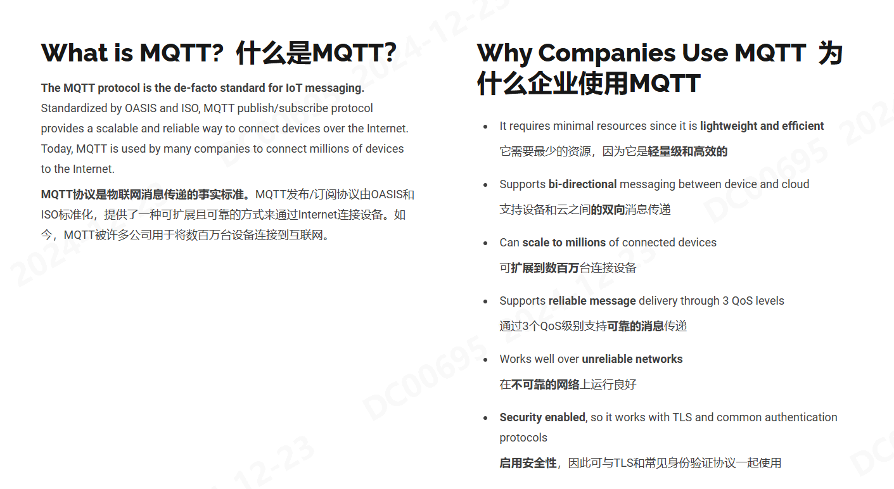
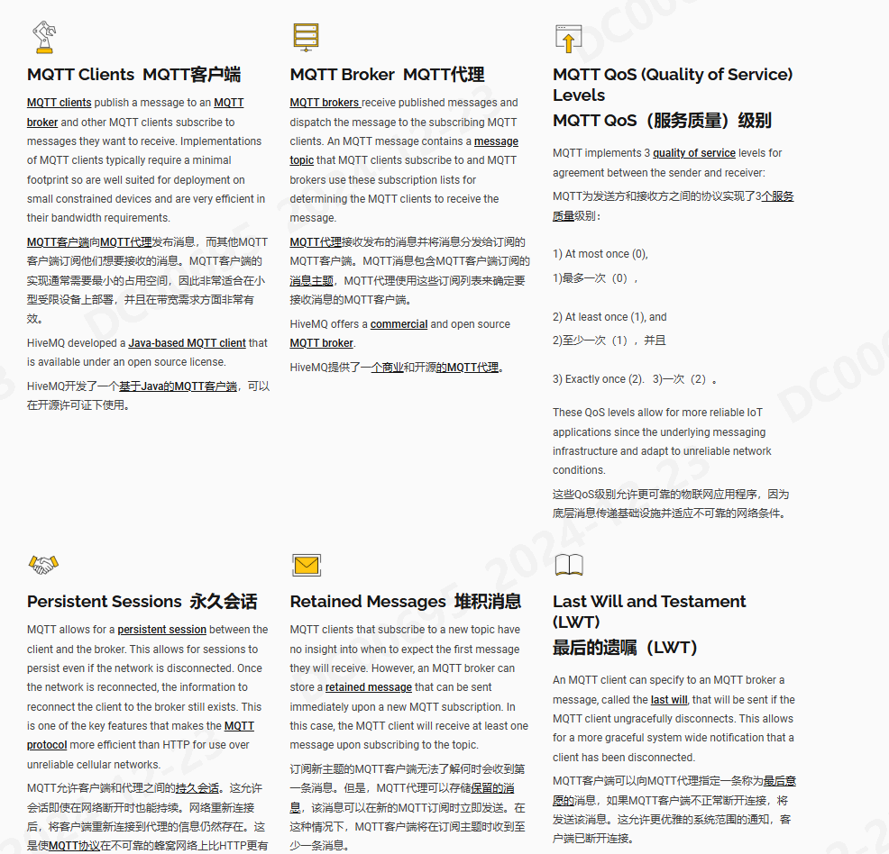

#   MQTT了解
## 参考文档
[MQTT官方文档（English）](https://mqtt.org/getting-started/)
[MQTT中文文档](https://www.emqx.com/zh/blog/the-easiest-guide-to-getting-started-with-mqtt)
##  MQTT需要了解的几个问题
- MQTT概述
- 几个关键概念
- MQTT的技术原理
- 简单MQTT的DEMO

## MQTT概述
MQTT（Message Queuing Telemetry Transport，消息队列遥测传输协议）是ISO (ISO/IEC) 规定的轻量级通讯协议。它被设计为基于可变长报头和可变负载的发布/订阅的消息传输机制。

## 几个关键概念

## MQTT的技术原理

## 常见问题和拓展
[一些相关的问题](http://www.steves-internet-guide.com/mqtt/)